<div align="center">

# NEXUS — Architecture

**A memory operating system for AI agents.**
Operational knowledge stored in CockroachDB as living memory that is born, competes,
mutates, merges, is promoted, and dies.

`thin agents · thick memory`

[Runbook](demo/README.md) · [Judge Q&A](demo/JUDGE_QA.md) · [Demo script](demo/DEMO_SCRIPT.md) · [Diagram gallery](diagrams/)

</div>

---

## Contents

| | |
|---|---|
| [0 · The thesis](#0--the-thesis) | why this is not RAG with extra steps |
| [1 · The closed loop](#1--the-closed-loop) | the whole system in one diagram |
| [2 · The memory](#2--the-memory) | four tiers, nine tables, and what enforces each lifetime |
| [3 · Encoding](#3--encoding) | one ruler, or every distance is measured differently |
| [4 · Retrieval](#4--retrieval) | the hybrid filtered k-NN, and the index that serves it |
| [5 · The agents](#5--the-agents) | five thin Lambdas, and what each is not allowed to do |
| [6 · Selection](#6--selection) | why a bandit and not a leaderboard |
| [7 · Action and rollback](#7--action-and-rollback) | act, verify, undo |
| [8 · Provenance](#8--provenance) | the replay, and the bug that would make it a lie |
| [9 · Evolution](#9--evolution) | birth, growth, mutation, merge, promotion, death |
| [10 · The nervous system](#10--the-nervous-system) | at-least-once delivery, exactly-once execution |
| [11 · Multi-region](#11--multi-region) | what each locality actually buys |
| [12 · Deployment](#12--deployment) | what is actually running on AWS |
| [13 · Security](#13--security) | trust boundaries and least privilege |
| [14 · Failure semantics](#14--failure-semantics) | what happens when things go wrong |
| [15 · Verification](#15--verification) | every claim, and the command that proves it |
| [16 · The synthetic world](#16--the-synthetic-world) | how a demo becomes an experiment |
| [17 · The technology surface](#17--the-technology-surface) | every capability, on one page |
| [18 · Repository map](#18--repository-map) | where everything lives |
| [19 · Locked decisions](#19--locked-decisions) | the choices that are load-bearing |
| [20 · What is not built](#20--what-is-not-built) | the honest list |

---

## 0 · The thesis

An agent that cannot remember cannot improve. Most "agent memory" is a transcript:
text retrieved to condition a generation, where the model does the deciding and the
store is a filing cabinet.

NEXUS inverts that. **Retrieval *is* the decision.** A telemetry trajectory is
embedded and matched against the trajectories of past incidents; the k nearest
neighbours' outcomes *are* the parameters of a Beta posterior; that posterior decides
whether to predict, whether to act, and which remediation gets the turn. No language
model appears anywhere in that path.

A model appears in exactly three places, all of them authoring a new playbook genome:
**birth**, **mutation**, **merge**. Everything else is vector search and arithmetic
over columns — which is why `make backtest` can put a number on it.

And the memory is not static. Playbooks carry a family tree. They are selected by
Thompson sampling so a newborn genome with no evidence still gets a turn; they breed a
variant when they fail; two convergent siblings are replaced by one canonical child;
proven doctrine is promoted into a `GLOBAL` table read locally in every region; and a
playbook that keeps losing is retired — after breeding on the way down, which is the
entire point of the mechanism.

> **The design principle throughout is *thin agents, thick memory*.** Each agent is a
> small, auditable Lambda. None of them holds state. All of the intelligence — the
> posterior, the competition, the lineage, the retention policy, the audit trail — is a
> property of the database.

---

## 1 · The closed loop

Telemetry becomes a vector, the vector becomes a prediction, the prediction becomes a
changefeed event, the event becomes a pipeline, the pipeline acts on the fleet that
produced the telemetry — and every step of it writes back into the memory that made the
next decision better.

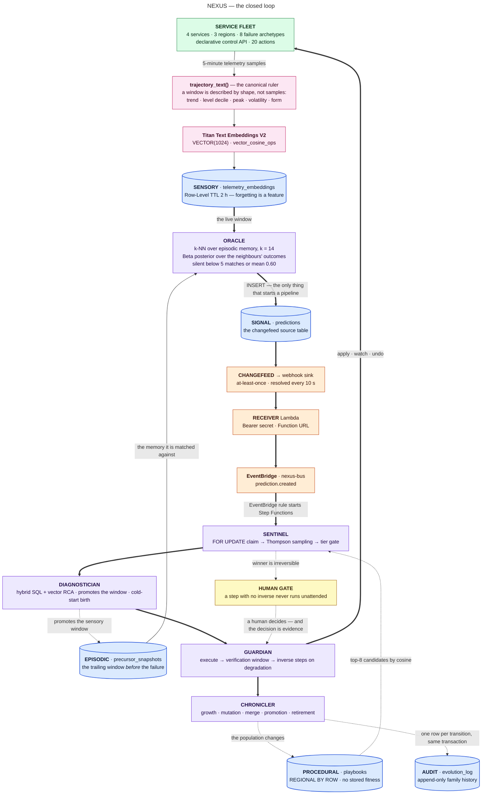
```mermaid
---
title: NEXUS — the closed loop
config:
  flowchart:
    curve: basis
    wrappingWidth: 420
    nodeSpacing: 45
    rankSpacing: 55
---
flowchart TB
    classDef substrate fill:#dcfce7,stroke:#15803d,stroke-width:1px,color:#052e16
    classDef memory    fill:#dbeafe,stroke:#1d4ed8,stroke-width:1.5px,color:#0b1a3a
    classDef compute   fill:#ffedd5,stroke:#c2410c,stroke-width:1px,color:#3b1206
    classDef agent     fill:#ede9fe,stroke:#6d28d9,stroke-width:1px,color:#210b4a
    classDef human     fill:#fef9c3,stroke:#a16207,stroke-width:1px,color:#3b2606
    classDef model     fill:#fce7f3,stroke:#be185d,stroke-width:1px,color:#3f0a24

    FLEET["<b>SERVICE FLEET</b><br/>4 services · 3 regions · 8 failure archetypes<br/>declarative control API · 20 actions"]
    TXT["<b>trajectory_text&lpar;&rpar;</b> — the canonical ruler<br/>a window is described by shape, not samples:<br/>trend · level decile · peak · volatility · form"]
    EMB["<b>Titan Text Embeddings V2</b><br/>VECTOR&lpar;1024&rpar; · vector_cosine_ops"]

    T1[("<b>SENSORY</b> · telemetry_embeddings<br/>Row-Level TTL 2 h — forgetting is a feature")]
    T2[("<b>EPISODIC</b> · precursor_snapshots<br/>the trailing window <i>before</i> the failure")]
    T3[("<b>PROCEDURAL</b> · playbooks<br/>REGIONAL BY ROW · no stored fitness")]
    SIG[("<b>SIGNAL</b> · predictions<br/>the changefeed source table")]
    AUD[("<b>AUDIT</b> · evolution_log<br/>append-only family history")]

    ORA["<b>ORACLE</b><br/>k-NN over episodic memory, k = 14<br/>Beta posterior over the neighbours' outcomes<br/>silent below 5 matches or mean 0.60"]

    CF["<b>CHANGEFEED</b> → webhook sink<br/>at-least-once · resolved every 10 s"]
    RCV["<b>RECEIVER</b> Lambda<br/>Bearer secret · Function URL"]
    BUS["<b>EventBridge</b> · nexus-bus<br/>prediction.created"]

    SEN["<b>SENTINEL</b><br/>FOR UPDATE claim → Thompson sampling → tier gate"]
    DIA["<b>DIAGNOSTICIAN</b><br/>hybrid SQL + vector RCA · promotes the window · cold-start birth"]
    GUA["<b>GUARDIAN</b><br/>execute → verification window → inverse steps on degradation"]
    CHR["<b>CHRONICLER</b><br/>growth · mutation · merge · promotion · retirement"]
    GATE["<b>HUMAN GATE</b><br/>a step with no inverse never runs unattended"]

    FLEET -- "5-minute telemetry samples" --> TXT
    TXT --> EMB
    EMB --> T1
    T1 == "the live window" ==> ORA
    T2 -- "the memory it is matched against" --> ORA
    ORA == "INSERT — the only thing that starts a pipeline" ==> SIG
    SIG ==> CF ==> RCV ==> BUS
    BUS == "EventBridge rule starts Step Functions" ==> SEN
    SEN ==> DIA ==> GUA ==> CHR
    T3 -. "top-8 candidates by cosine" .-> SEN
    SEN -. "winner is irreversible" .-> GATE
    GATE -. "a human decides — and the decision is evidence" .-> GUA
    GUA == "apply · watch · undo" ==> FLEET
    DIA -. "promotes the sensory window" .-> T2
    CHR -. "the population changes" .-> T3
    CHR -. "one row per transition, same transaction" .-> AUD

    class FLEET substrate
    class TXT,EMB model
    class T1,T2,T3,SIG,AUD memory
    class CF,RCV,BUS compute
    class ORA,SEN,DIA,GUA,CHR agent
    class GATE human
```

**The spine, precisely.** An `INSERT` into `predictions` is the *only* thing that starts
a pipeline. A CockroachDB changefeed on that table POSTs to a Lambda Function URL, which
authenticates a `Bearer` shared secret and republishes to EventBridge, where a rule starts
a Step Functions execution. Building that plumbing before anything else is what makes every
later capability demoable rather than described.

---

## 2 · The memory

Nine tables organized as four memory tiers plus a signal, an audit log and a human queue.
The tiering is not a metaphor: **each tier has a different lifetime, and something in the
database — not in application code — enforces it.**

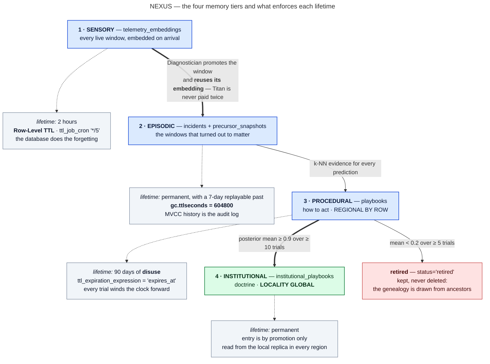
```mermaid
---
title: NEXUS — the four memory tiers and what enforces each lifetime
config:
  flowchart:
    curve: basis
    wrappingWidth: 460
    rankSpacing: 60
---
flowchart TB
    classDef tier   fill:#dbeafe,stroke:#1d4ed8,stroke-width:1.5px,color:#0b1a3a
    classDef rule   fill:#f1f5f9,stroke:#64748b,stroke-width:1px,color:#0f172a
    classDef gone   fill:#fee2e2,stroke:#b91c1c,stroke-width:1px,color:#450a0a
    classDef glob   fill:#dcfce7,stroke:#15803d,stroke-width:1.5px,color:#052e16

    S["<b>1 · SENSORY</b> — telemetry_embeddings<br/>every live window, embedded on arrival"]
    SR["<i>lifetime:</i> 2 hours<br/><b>Row-Level TTL</b> · ttl_job_cron '*/5'<br/>the database does the forgetting"]

    E["<b>2 · EPISODIC</b> — incidents + precursor_snapshots<br/>the windows that turned out to matter"]
    ER["<i>lifetime:</i> permanent, with a 7-day replayable past<br/><b>gc.ttlseconds = 604800</b><br/>MVCC history is the audit log"]

    P["<b>3 · PROCEDURAL</b> — playbooks<br/>how to act · REGIONAL BY ROW"]
    PR["<i>lifetime:</i> 90 days of <b>disuse</b><br/>ttl_expiration_expression = 'expires_at'<br/>every trial winds the clock forward"]

    I["<b>4 · INSTITUTIONAL</b> — institutional_playbooks<br/>doctrine · <b>LOCALITY GLOBAL</b>"]
    IR["<i>lifetime:</i> permanent<br/>entry is by promotion only<br/>read from the local replica in every region"]

    DEAD["<b>retired</b> — status='retired'<br/>kept, never deleted:<br/>the genealogy is drawn from ancestors"]

    S == "Diagnostician promotes the window<br/>and <b>reuses its embedding</b> — Titan is never paid twice" ==> E
    E -- "k-NN evidence for every prediction" --> P
    P == "posterior mean &ge; 0.9 over &ge; 10 trials" ==> I
    P -- "mean &lt; 0.2 over &ge; 5 trials" --> DEAD

    S -.-> SR
    E -.-> ER
    P -.-> PR
    I -.-> IR

    class S,E,P tier
    class I glob
    class SR,ER,PR,IR rule
    class DEAD gone
```

A window only becomes episodic if Diagnostician promotes it, and the promotion **reuses
the sensory row's embedding** rather than paying Titan twice for the same bytes.

### The schema

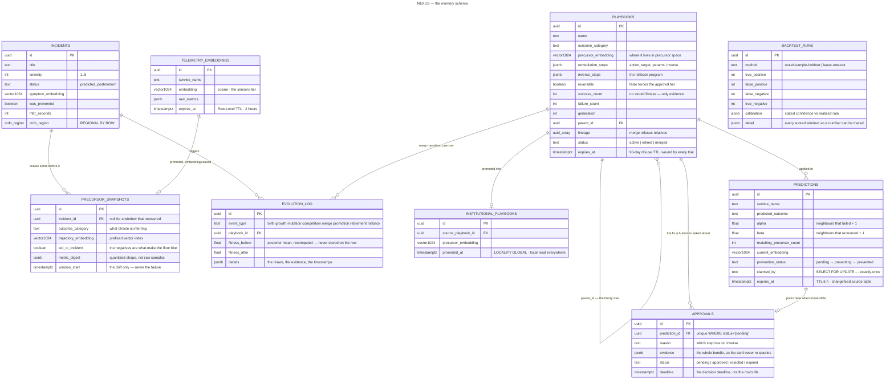
```mermaid
---
title: NEXUS — the memory schema
---
erDiagram
    INCIDENTS ||--o{ PRECURSOR_SNAPSHOTS : "leaves a trail before it"
    INCIDENTS ||--o{ EVOLUTION_LOG : "triggers"
    PLAYBOOKS ||--o{ PLAYBOOKS : "parent_id — the family tree"
    PLAYBOOKS ||--o{ EVOLUTION_LOG : "every transition, one row"
    PLAYBOOKS ||--o| INSTITUTIONAL_PLAYBOOKS : "promoted into"
    PLAYBOOKS ||--o{ PREDICTIONS : "applied to"
    PLAYBOOKS ||--o{ APPROVALS : "the fix a human is asked about"
    PREDICTIONS ||--o| APPROVALS : "parks here when irreversible"
    TELEMETRY_EMBEDDINGS ||--o| PRECURSOR_SNAPSHOTS : "promoted, embedding reused"

    TELEMETRY_EMBEDDINGS {
        uuid id PK
        text service_name
        vector1024 embedding "cosine · the sensory tier"
        jsonb raw_metrics
        timestamptz expires_at "Row-Level TTL · 2 hours"
    }

    PRECURSOR_SNAPSHOTS {
        uuid id PK
        uuid incident_id FK "null for a window that recovered"
        text outcome_category "what Oracle is inferring"
        vector1024 trajectory_embedding "prefixed vector index"
        boolean led_to_incident "the negatives are what make the floor bite"
        jsonb metric_digest "quantized shape, not raw samples"
        timestamptz window_start "the drift only — never the failure"
    }

    INCIDENTS {
        uuid id PK
        text title
        int severity "1..5"
        text status "predicted..postmortem"
        vector1024 symptom_embedding
        boolean was_prevented
        int mttr_seconds
        crdb_region crdb_region "REGIONAL BY ROW"
    }

    PLAYBOOKS {
        uuid id PK
        text name
        text outcome_category
        vector1024 precursor_embedding "where it lives in precursor space"
        jsonb remediation_steps "action, target, params, inverse"
        jsonb inverse_steps "the rollback program"
        boolean reversible "false forces the approval tier"
        int success_count "no stored fitness — only evidence"
        int failure_count
        int generation
        uuid parent_id FK
        uuid_array lineage "merge refuses relatives"
        text status "active | retired | merged"
        timestamptz expires_at "90-day disuse TTL, wound by every trial"
    }

    INSTITUTIONAL_PLAYBOOKS {
        uuid id PK
        uuid source_playbook_id FK
        vector1024 precursor_embedding
        timestamptz promoted_at "LOCALITY GLOBAL · local read everywhere"
    }

    PREDICTIONS {
        uuid id PK
        text service_name
        text predicted_outcome
        float alpha "neighbours that failed + 1"
        float beta "neighbours that recovered + 1"
        int matching_precursor_count
        vector1024 current_embedding
        text prevention_status "pending → preventing → prevented"
        text claimed_by "SELECT FOR UPDATE — exactly-once"
        timestamptz expires_at "TTL 6 h · changefeed source table"
    }

    APPROVALS {
        uuid id PK
        uuid prediction_id FK "unique WHERE status='pending'"
        text reason "which step has no inverse"
        jsonb evidence "the whole bundle, so the card never re-queries"
        text status "pending | approved | rejected | expired"
        timestamptz deadline "the decision deadline, not the row's life"
    }

    EVOLUTION_LOG {
        uuid id PK
        text event_type "birth growth mutation competition merge promotion retirement rollback"
        uuid playbook_id FK
        float fitness_before "posterior mean, recomputed — never stored on the row"
        float fitness_after
        jsonb details "the draws, the evidence, the timestamps"
    }

    BACKTEST_RUNS {
        uuid id PK
        text method "out-of-sample-holdout | leave-one-out"
        int true_positive
        int false_positive
        int false_negative
        int true_negative
        jsonb calibration "stated confidence vs realized rate"
        jsonb detail "every scored window, so a number can be traced"
    }
```

Three details in that diagram carry most of the design:

**`playbooks` has no fitness column.** Fitness is `Beta(success_count + 1, failure_count + 1)`
computed at read time in `nexus_common/posterior.py`. There is no cached float that can
drift away from the evidence it was derived from, and no migration needed when the scoring
rule changes.

**`predictions` stores `alpha` and `beta`, not a confidence.** "3 of 3 neighbours agree" and
"30 of 30 agree" have the same mean and radically different credible intervals. Storing both
parameters means any consumer downstream can recompute the interval rather than trusting a
number someone else collapsed.

**`evolution_log` is not written by any lifecycle function.** Each Chronicler function
*returns* the rows it earned, and a single caller inserts them alongside the mutations in
one serializable transaction. A lifecycle change therefore cannot reach the database without
its log row — not by oversight, not by a future refactor.

---

## 3 · Encoding

Every vector in the system — seeded snapshots, live windows, playbook positions — passes
through one function. If seed-time and query-time serialization ever diverged, every cosine
distance in the database would be measured against a different ruler, and nothing would
report an error.

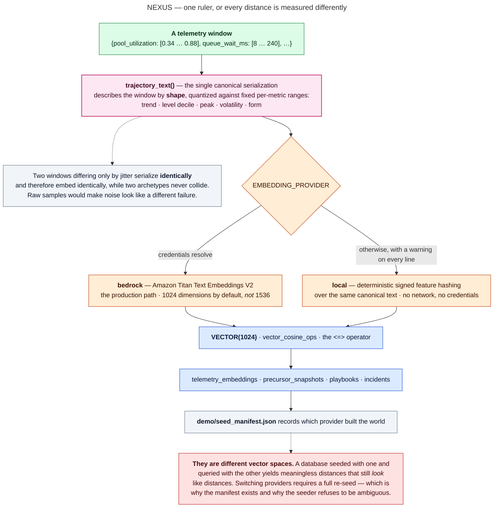
```mermaid
---
title: NEXUS — one ruler, or every distance is measured differently
config:
  flowchart:
    curve: basis
    wrappingWidth: 700
---
flowchart TB
    classDef raw   fill:#dcfce7,stroke:#15803d,color:#052e16
    classDef canon fill:#fce7f3,stroke:#be185d,stroke-width:1.5px,color:#3f0a24
    classDef prov  fill:#ffedd5,stroke:#c2410c,color:#3b1206
    classDef mem   fill:#dbeafe,stroke:#1d4ed8,color:#0b1a3a
    classDef note  fill:#f1f5f9,stroke:#64748b,color:#0f172a
    classDef bad   fill:#fee2e2,stroke:#b91c1c,color:#450a0a

    W["<b>A telemetry window</b><br/>{pool_utilization: [0.34 … 0.88], queue_wait_ms: [8 … 240], …}"]
    T["<b>trajectory_text&lpar;&rpar;</b> — the single canonical serialization<br/>describes the window by <b>shape</b>, quantized against fixed per-metric ranges:<br/>trend · level decile · peak · volatility · form"]
    WHY["Two windows differing only by jitter serialize <b>identically</b><br/>and therefore embed identically, while two archetypes never collide.<br/>Raw samples would make noise look like a different failure."]

    D{"EMBEDDING_PROVIDER"}
    BR["<b>bedrock</b> — Amazon Titan Text Embeddings V2<br/>the production path · 1024 dimensions by default, <i>not</i> 1536"]
    LO["<b>local</b> — deterministic signed feature hashing<br/>over the same canonical text · no network, no credentials"]

    V["<b>VECTOR&lpar;1024&rpar;</b> · vector_cosine_ops · the &lt;=&gt; operator"]
    S["telemetry_embeddings · precursor_snapshots · playbooks · incidents"]
    MAN["<b>demo/seed_manifest.json</b> records which provider built the world"]
    TRAP["<b>They are different vector spaces.</b> A database seeded with one and<br/>queried with the other yields meaningless distances that still <i>look</i><br/>like distances. Switching providers requires a full re-seed — which is<br/>why the manifest exists and why the seeder refuses to be ambiguous."]

    W --> T --> D
    T -.-> WHY
    D -- "credentials resolve" --> BR
    D -- "otherwise, with a warning on every line" --> LO
    BR --> V
    LO --> V
    V --> S
    S --> MAN
    MAN -.-> TRAP

    class W raw
    class T canon
    class BR,LO,D prov
    class V,S mem
    class WHY,MAN note
    class TRAP bad
```

`trajectory_text()` describes a window by **shape**: trend, level decile, peak, volatility,
form — quantized against fixed per-metric ranges in `METRIC_SCALES`. Two windows differing
only by jitter serialize identically and therefore embed identically. Two archetypes never
collide.

---

## 4 · Retrieval

The queries NEXUS actually runs are not pure nearest-neighbour searches. They are *filtered*
ones:

```sql
-- Sentinel: which playbook is about this situation?
SELECT id, name, success_count, failure_count,
       precursor_embedding <=> $2 AS distance
  FROM playbooks
 WHERE outcome_category = $1 AND status = 'active'
 ORDER BY precursor_embedding <=> $2
 LIMIT 8;
```

Against an unprefixed vector index the planner cannot combine the two halves: it picks the
secondary index on the filter columns, index-joins, and sorts the survivors. Correct — but a
scan, and it stops being acceptable as the memory grows.

CockroachDB vector indexes accept **prefix columns** before the vector column, which
partitions the index and lets one lookup serve the whole query:

```sql
CREATE VECTOR INDEX playbooks_category_status_precursor_idx
    ON playbooks (outcome_category, status, precursor_embedding vector_cosine_ops);
```

`EXPLAIN` then shows a `vector search` node with `prefix spans`. `make verify` asserts
exactly that shape, and separately asserts **recall 1.000 against an exact scan** — because
an approximate index that returns plausible neighbours is indistinguishable from a correct
one until you check.

> **The tradeoff we left open, deliberately.** A prefixed index cannot serve a query that
> supplies no prefix value — and Oracle's neighbourhood query has no category filter *by
> design*, because the category is the thing it is inferring. Filtering by it would assume
> the conclusion. With the unprefixed index removed, that one query falls back to a scan and
> sort. Invisible at 155 snapshots; not invisible at a million. It is in the gaps table.

---

## 5 · The agents

Five agents in the decision path, two in the plumbing, one serving the dashboard. Every one
of them is a Lambda importing the same `nexus_common` layer.

| Agent | Trigger | What it does | What it is not allowed to do |
|---|---|---|---|
| **Oracle** | EventBridge schedule | k-NN over episodic memory → Beta posterior → `INSERT` a prediction | Emit below 5 neighbours at 0.72 similarity, or below a 0.60 posterior mean |
| **Sentinel** | Step Functions · 1 | `FOR UPDATE` claim → Thompson-sampled competition → tier gate | Execute anything itself; act at all below 0.75; run an irreversible fix unattended |
| **Diagnostician** | Step Functions · 2 | Promote the window into episodic memory, hybrid RCA retrieval, cold-start birth | Insert a genome that fails `PlaybookDraft` validation |
| **Guardian** | Step Functions · 3 | Execute, watch a verification window, roll back on degradation | Report a fix it never ran; call "flat" a success |
| **Chronicler** | Step Functions · 4 | Growth, mutation, merge, promotion, retirement, and the stale sweep | Mutate a playbook without writing its `evolution_log` row in the same transaction |
| **Receiver** | Lambda Function URL | Validate the `Bearer` secret, parse the changefeed envelope, publish to `nexus-bus` | Parse a byte before authenticating |
| **Poller** | Schedule, `Enabled: false` | Plan B — republish the same events from `predictions` if the webhook sink misbehaves | Run at the same time as the changefeed |
| **Dashboard** | Lambda Function URL | 8 read routes + 2 control routes, mostly at `follower_read_timestamp()` | Compute a number the database cannot produce |

The full sequence, with the branches that matter:

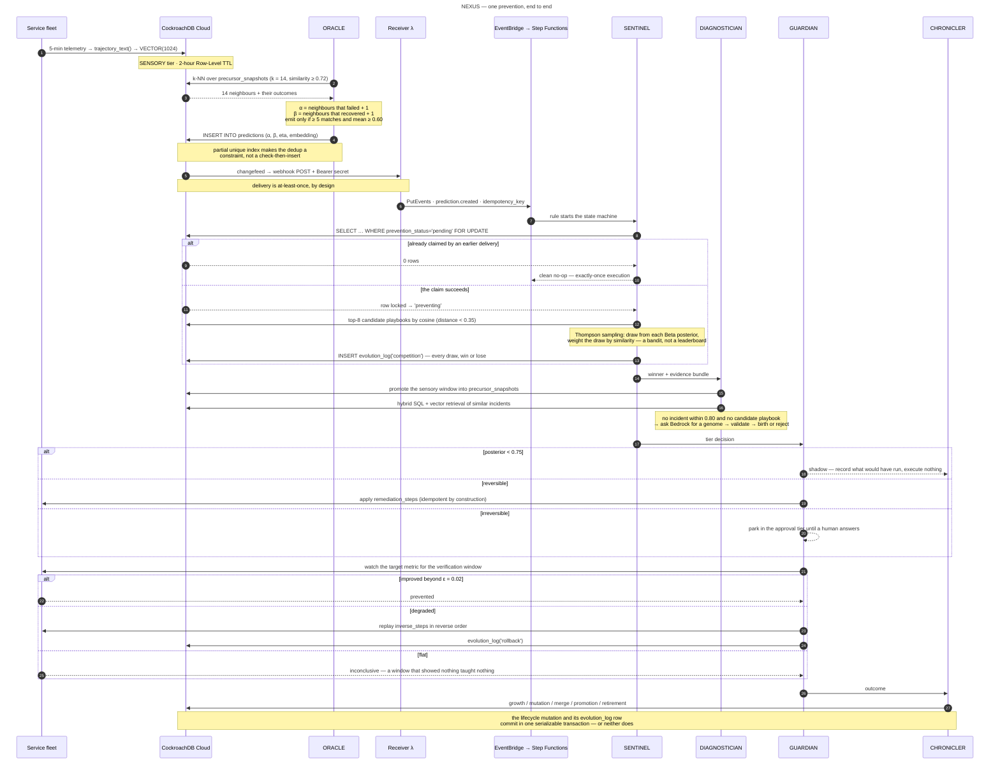
```mermaid
---
title: NEXUS — one prevention, end to end
---
sequenceDiagram
    autonumber
    participant F as Service fleet
    participant DB as CockroachDB Cloud
    participant O as ORACLE
    participant R as Receiver λ
    participant EB as EventBridge → Step Functions
    participant S as SENTINEL
    participant D as DIAGNOSTICIAN
    participant G as GUARDIAN
    participant C as CHRONICLER

    F->>DB: 5-min telemetry → trajectory_text() → VECTOR(1024)
    Note over DB: SENSORY tier · 2-hour Row-Level TTL

    O->>DB: k-NN over precursor_snapshots (k = 14, similarity ≥ 0.72)
    DB-->>O: 14 neighbours + their outcomes
    Note over O: α = neighbours that failed + 1<br/>β = neighbours that recovered + 1<br/>emit only if ≥ 5 matches and mean ≥ 0.60
    O->>DB: INSERT INTO predictions (α, β, eta, embedding)
    Note over O,DB: partial unique index makes the dedup a<br/>constraint, not a check-then-insert

    DB->>R: changefeed → webhook POST + Bearer secret
    Note over DB,R: delivery is at-least-once, by design
    R->>EB: PutEvents · prediction.created · idempotency_key
    EB->>S: rule starts the state machine

    S->>DB: SELECT … WHERE prevention_status='pending' FOR UPDATE
    alt already claimed by an earlier delivery
        DB-->>S: 0 rows
        S-->>EB: clean no-op — exactly-once execution
    else the claim succeeds
        DB-->>S: row locked → 'preventing'
        S->>DB: top-8 candidate playbooks by cosine (distance < 0.35)
        Note over S: Thompson sampling: draw from each Beta posterior,<br/>weight the draw by similarity — a bandit, not a leaderboard
        S->>DB: INSERT evolution_log('competition') — every draw, win or lose
    end

    S->>D: winner + evidence bundle
    D->>DB: promote the sensory window into precursor_snapshots
    D->>DB: hybrid SQL + vector retrieval of similar incidents
    Note over D: no incident within 0.80 and no candidate playbook<br/>→ ask Bedrock for a genome → validate → birth or reject

    S->>G: tier decision
    alt posterior < 0.75
        G-->>C: shadow — record what would have run, execute nothing
    else reversible
        G->>F: apply remediation_steps (idempotent by construction)
    else irreversible
        G-->>G: park in the approval tier until a human answers
    end

    G->>F: watch the target metric for the verification window
    alt improved beyond ε = 0.02
        F-->>G: prevented
    else degraded
        G->>F: replay inverse_steps in reverse order
        G->>DB: evolution_log('rollback')
    else flat
        F-->>G: inconclusive — a window that showed nothing taught nothing
    end

    G->>C: outcome
    C->>DB: growth / mutation / merge / promotion / retirement
    Note over C,DB: the lifecycle mutation and its evolution_log row<br/>commit in one serializable transaction — or neither does
```

### Oracle — prediction with a posterior

```
alpha = matched precursors that led to an incident + 1
beta  = matched precursors that recovered on their own + 1
```

The **negatives are what make the emit gate bite**: of the 155 seeded snapshots, **35 are
windows that recovered** — the same drift curve with the failure removed and the drift halted
52–78% of the way in.
Without them the system has never seen drift that resolved itself, and every wobble becomes
a prediction.

ETA is the median lead time of the matched precursors, scaled by how far through its drift
the live window appears to be — computed from the quantized end-levels both the live digest
and the matched digests already carry, so it is derived from stored evidence rather than
guessed.

Deduplication is a **partial unique index**, not a check-then-insert:

```sql
CREATE UNIQUE INDEX predictions_active_dedup_idx
    ON predictions (service_name, predicted_outcome)
    WHERE prevention_status IN ('pending','preventing');
```

Two concurrent Oracle cycles cannot both emit, because the database refuses — not because
the code checked first and hoped.

---

## 6 · Selection

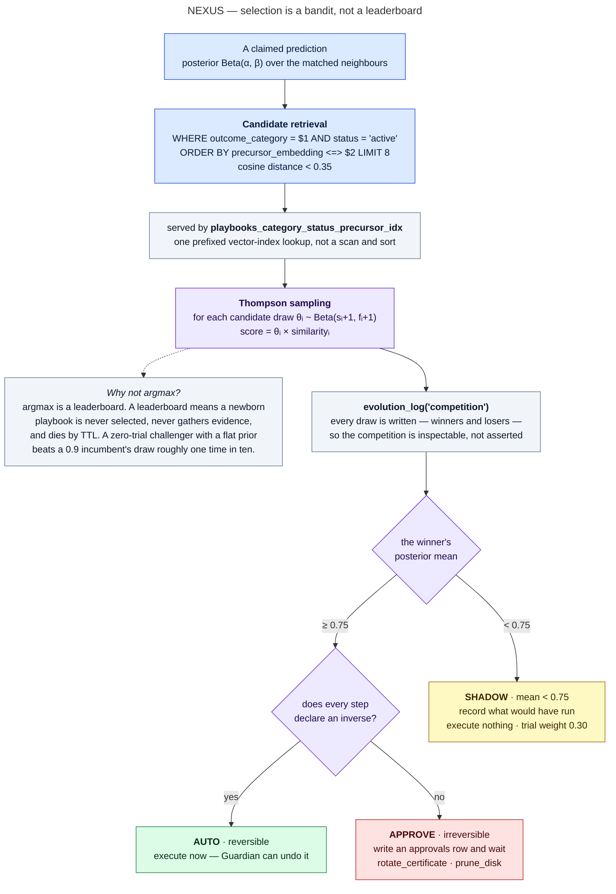
```mermaid
---
title: NEXUS — selection is a bandit, not a leaderboard
config:
  flowchart:
    curve: basis
    wrappingWidth: 700
---
flowchart TB
    classDef mem  fill:#dbeafe,stroke:#1d4ed8,color:#0b1a3a
    classDef calc fill:#ede9fe,stroke:#6d28d9,color:#210b4a
    classDef good fill:#dcfce7,stroke:#15803d,color:#052e16
    classDef warn fill:#fef9c3,stroke:#a16207,color:#3b2606
    classDef bad  fill:#fee2e2,stroke:#b91c1c,color:#450a0a
    classDef note fill:#f1f5f9,stroke:#64748b,color:#0f172a

    P["A claimed prediction<br/>posterior Beta&lpar;α, β&rpar; over the matched neighbours"]
    Q["<b>Candidate retrieval</b><br/>WHERE outcome_category = $1 AND status = 'active'<br/>ORDER BY precursor_embedding &lt;=&gt; $2 LIMIT 8<br/>cosine distance &lt; 0.35"]
    IDX["served by <b>playbooks_category_status_precursor_idx</b><br/>one prefixed vector-index lookup, not a scan and sort"]

    D["<b>Thompson sampling</b><br/>for each candidate draw θᵢ ~ Beta&lpar;sᵢ+1, fᵢ+1&rpar;<br/>score = θᵢ × similarityᵢ"]
    WHY["<i>Why not argmax?</i><br/>argmax is a leaderboard. A leaderboard means a newborn<br/>playbook is never selected, never gathers evidence,<br/>and dies by TTL. A zero-trial challenger with a flat prior<br/>beats a 0.9 incumbent's draw roughly one time in ten."]
    LOG["<b>evolution_log&lpar;'competition'&rpar;</b><br/>every draw is written — winners and losers —<br/>so the competition is inspectable, not asserted"]

    W{"the winner's<br/>posterior mean"}
    REV{"does every step<br/>declare an inverse?"}

    SH["<b>SHADOW</b> · mean &lt; 0.75<br/>record what would have run<br/>execute nothing · trial weight 0.30"]
    AUTO["<b>AUTO</b> · reversible<br/>execute now — Guardian can undo it"]
    APPR["<b>APPROVE</b> · irreversible<br/>write an approvals row and wait<br/>rotate_certificate · prune_disk"]

    P --> Q --> IDX --> D --> LOG --> W
    D -.-> WHY
    W -- "&lt; 0.75" --> SH
    W -- "≥ 0.75" --> REV
    REV -- "yes" --> AUTO
    REV -- "no" --> APPR

    class P,Q mem
    class IDX,LOG,WHY note
    class D calc
    class W,REV calc
    class SH warn
    class AUTO good
    class APPR bad
```

Every draw — winners and losers — is written to `evolution_log`, so the competition is
inspectable rather than asserted. The dashboard's competition viewer reads those rows
directly.

**One rule protects the population from itself:** a playbook does not breed while it already
has an untried variant. Without it, a playbook that keeps losing produces a child per
rollback until the candidate list is nothing but untested siblings.

---

## 7 · Action and rollback

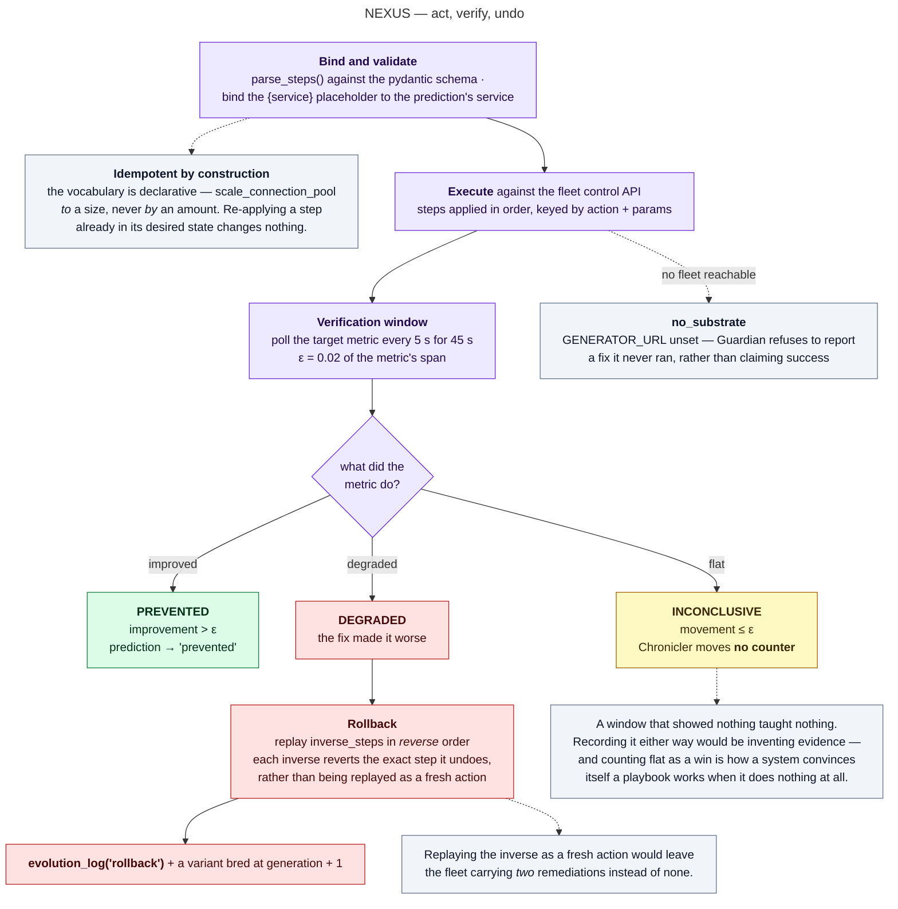
```mermaid
---
title: NEXUS — act, verify, undo
config:
  flowchart:
    curve: basis
    wrappingWidth: 700
---
flowchart TB
    classDef act  fill:#ede9fe,stroke:#6d28d9,color:#210b4a
    classDef good fill:#dcfce7,stroke:#15803d,color:#052e16
    classDef bad  fill:#fee2e2,stroke:#b91c1c,color:#450a0a
    classDef warn fill:#fef9c3,stroke:#a16207,color:#3b2606
    classDef note fill:#f1f5f9,stroke:#64748b,color:#0f172a

    A["<b>Bind and validate</b><br/>parse_steps&lpar;&rpar; against the pydantic schema ·<br/>bind the {service} placeholder to the prediction's service"]
    IDEM["<b>Idempotent by construction</b><br/>the vocabulary is declarative — scale_connection_pool<br/><i>to</i> a size, never <i>by</i> an amount. Re-applying a step<br/>already in its desired state changes nothing."]
    B["<b>Execute</b> against the fleet control API<br/>steps applied in order, keyed by action + params"]
    C["<b>Verification window</b><br/>poll the target metric every 5 s for 45 s<br/>ε = 0.02 of the metric's span"]
    D{"what did the<br/>metric do?"}

    OK["<b>PREVENTED</b><br/>improvement &gt; ε<br/>prediction → 'prevented'"]
    FLAT["<b>INCONCLUSIVE</b><br/>movement ≤ ε<br/>Chronicler moves <b>no counter</b>"]
    BADD["<b>DEGRADED</b><br/>the fix made it worse"]

    RB["<b>Rollback</b><br/>replay inverse_steps in <i>reverse</i> order<br/>each inverse reverts the exact step it undoes,<br/>rather than being replayed as a fresh action"]
    RBW["Replaying the inverse as a fresh action would leave<br/>the fleet carrying <i>two</i> remediations instead of none."]
    EV["<b>evolution_log&lpar;'rollback'&rpar;</b> + a variant bred at generation + 1"]
    FLATW["A window that showed nothing taught nothing.<br/>Recording it either way would be inventing evidence —<br/>and counting flat as a win is how a system convinces<br/>itself a playbook works when it does nothing at all."]

    NOSUB["<b>no_substrate</b><br/>GENERATOR_URL unset — Guardian refuses to report<br/>a fix it never ran, rather than claiming success"]

    A --> B --> C --> D
    A -.-> IDEM
    D -- "improved" --> OK
    D -- "flat" --> FLAT
    D -- "degraded" --> BADD
    BADD --> RB --> EV
    RB -.-> RBW
    FLAT -.-> FLATW
    B -. "no fleet reachable" .-> NOSUB

    class A,B,C,D act
    class OK good
    class FLAT warn
    class BADD,RB,EV bad
    class IDEM,RBW,FLATW,NOSUB note
```

The action vocabulary is closed and declarative — 20 actions, validated by pydantic before
anything executes:

```
scale_connection_pool · recycle_connections · restart_worker · rolling_restart
set_circuit_breaker · flush_cache · warm_cache · set_cache_ttl · rotate_certificate
prune_disk · extend_volume · rollback_deploy · pin_deploy_version · scale_thread_pool
shed_load · set_dns_ttl · failover_resolver · set_retry_budget · scale_replicas
throttle_ingress
```

`rotate_certificate` and `prune_disk` are irreversible. A playbook containing either is not
`reversible` and can never run on the auto tier — which is a property of the *data*, not a
branch someone remembered to write.

A stored playbook targets `{service}`, not a service name: it is procedural memory — *how to
relieve pool exhaustion* — not *how to fix payments*. The target is bound at execution time
from the prediction being handled.

---

## 8 · Provenance

Every prediction can be re-read exactly as it was at the moment it was made — with no audit
table, no snapshot copies, and no write amplification. MVCC already holds the history;
`gc.ttlseconds = 604800` just keeps it readable for seven days.

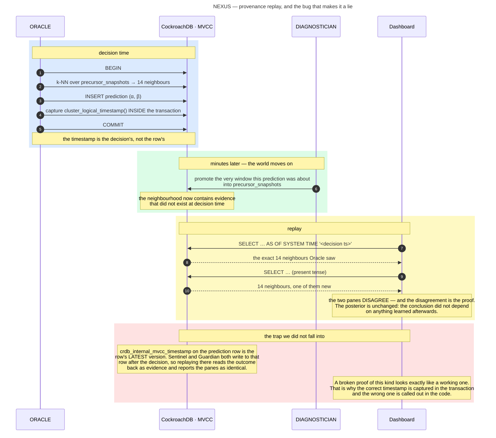
```mermaid
---
title: NEXUS — provenance replay, and the bug that makes it a lie
---
sequenceDiagram
    autonumber
    participant O as ORACLE
    participant DB as CockroachDB · MVCC
    participant D as DIAGNOSTICIAN
    participant UI as Dashboard

    rect rgb(219, 234, 254)
    Note over O,DB: decision time
    O->>DB: BEGIN
    O->>DB: k-NN over precursor_snapshots → 14 neighbours
    O->>DB: INSERT prediction (α, β)
    O->>DB: capture cluster_logical_timestamp() INSIDE the transaction
    O->>DB: COMMIT
    Note over O,DB: the timestamp is the decision's, not the row's
    end

    rect rgb(220, 252, 231)
    Note over D,DB: minutes later — the world moves on
    D->>DB: promote the very window this prediction was about<br/>into precursor_snapshots
    Note over DB: the neighbourhood now contains evidence<br/>that did not exist at decision time
    end

    rect rgb(254, 249, 195)
    Note over UI,DB: replay
    UI->>DB: SELECT … AS OF SYSTEM TIME '<decision ts>'
    DB-->>UI: the exact 14 neighbours Oracle saw
    UI->>DB: SELECT … (present tense)
    DB-->>UI: 14 neighbours, one of them new
    Note over UI: the two panes DISAGREE — and the disagreement is the proof.<br/>The posterior is unchanged: the conclusion did not depend<br/>on anything learned afterwards.
    end

    rect rgb(254, 226, 226)
    Note over UI,DB: the trap we did not fall into
    Note over DB: crdb_internal_mvcc_timestamp on the prediction row is the<br/>row's LATEST version. Sentinel and Guardian both write to that<br/>row after the decision, so replaying there reads the outcome<br/>back as evidence and reports the panes as identical.
    Note over UI: A broken proof of this kind looks exactly like a working one.<br/>That is why the correct timestamp is captured in the transaction<br/>and the wrong one is called out in the code.
    end
```

> **Why this is not "running the same query twice."** The two panes *disagree*, and the
> disagreement is the proof. Diagnostician later promotes the very window the prediction was
> about, so the live top-k gains a neighbour that did not exist at decision time — the UI
> names it. The posterior is unchanged, which is the actual claim: **the conclusion did not
> depend on anything learned afterwards.**

The trap in the box at the bottom of that diagram is real and was hit during the build. A
broken provenance proof looks exactly like a working one, which is why the wrong timestamp
source is called out in the code rather than merely avoided.

---

## 9 · Evolution

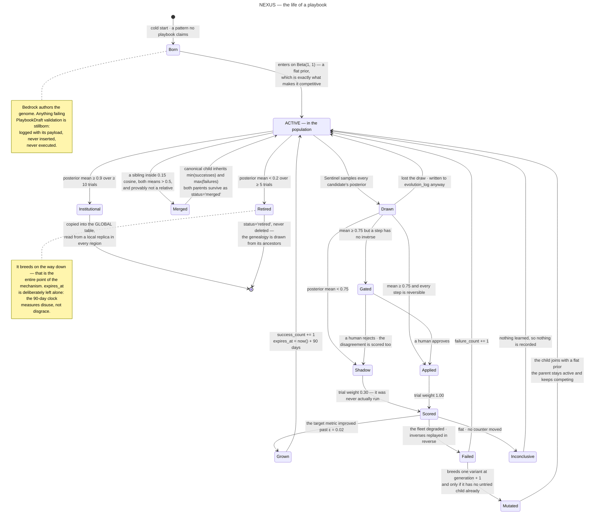
```mermaid
---
title: NEXUS — the life of a playbook
---
stateDiagram-v2
    direction TB

    [*] --> Born : cold start · a pattern no playbook claims

    Born --> Active : enters on Beta(1, 1) — a flat prior,<br/>which is exactly what makes it competitive

    state "ACTIVE — in the population" as Active

    Active --> Drawn : Sentinel samples every candidate's posterior
    Drawn --> Active : lost the draw · written to evolution_log anyway
    Drawn --> Shadow : posterior mean < 0.75
    Drawn --> Gated : mean ≥ 0.75 but a step has no inverse
    Drawn --> Applied : mean ≥ 0.75 and every step is reversible

    Gated --> Applied : a human approves
    Gated --> Shadow : a human rejects · the disagreement is scored too

    Shadow --> Scored : trial weight 0.30 — it was never actually run
    Applied --> Scored : trial weight 1.00

    Scored --> Grown : the target metric improved past ε = 0.02
    Scored --> Failed : the fleet degraded · inverses replayed in reverse
    Scored --> Inconclusive : flat · no counter moved

    Inconclusive --> Active : nothing learned, so nothing is recorded

    Grown --> Active : success_count += 1<br/>expires_at = now() + 90 days
    Failed --> Active : failure_count += 1
    Failed --> Mutated : breeds one variant at generation + 1<br/>and only if it has no untried child already

    Mutated --> Active : the child joins with a flat prior<br/>the parent stays active and keeps competing

    Active --> Merged : a sibling inside 0.15 cosine, both means > 0.5,<br/>and provably not a relative
    Merged --> Active : canonical child inherits min(successes) and max(failures)<br/>both parents survive as status='merged'

    Active --> Institutional : posterior mean ≥ 0.9 over ≥ 10 trials
    Active --> Retired : posterior mean < 0.2 over ≥ 5 trials

    Institutional --> [*] : copied into the GLOBAL table,<br/>read from a local replica in every region
    Retired --> [*] : status='retired', never deleted —<br/>the genealogy is drawn from its ancestors

    note right of Born
        Bedrock authors the genome. Anything failing
        PlaybookDraft validation is stillborn:
        logged with its payload, never inserted,
        never executed.
    end note

    note right of Retired
        It breeds on the way down — that is the
        entire point of the mechanism. expires_at
        is deliberately left alone: the 90-day clock
        measures disuse, not disgrace.
    end note
```

### The rules, and what each one prevents

| Rule | Threshold | What it prevents |
|---|---|---|
| **Selection** | Thompson draw × similarity | A leaderboard, where a newborn is never selected, never gathers evidence, and dies by TTL |
| **Growth** | `success_count += 1`, `expires_at = now() + 90d` | Memory that decays by age rather than by disuse |
| **Shadow weight** | 0.30 | Counting a playbook that never ran as though it had |
| **Mutation** | on rollback, generation + 1, one untried child at a time | Runaway breeding into a population of untested siblings |
| **Merge** | distance < 0.15, both means > 0.5, **not relatives** | Every family collapsing into itself — a mutation sits at its parent's position, so `LIMIT 1` on distance returns the parent every time |
| **Merge inheritance** | `min(successes)`, `max(failures)` | Retiring two proven playbooks in favour of an untested child, leaving a hole where the memory was strongest |
| **Promotion** | mean ≥ 0.9 over ≥ 10 trials | Doctrine promoted on a lucky streak |
| **Retirement** | mean < 0.2 over ≥ 5 trials | Keeping a genome that has been shown not to work |
| **Retirement is not deletion** | `status='retired'`, `expires_at` untouched | Deleting the ancestry the genealogy tree is drawn from |
| **Inconclusive** | movement ≤ ε | Inventing evidence from a window that showed nothing |

### Three real families, read out of the seeded cluster

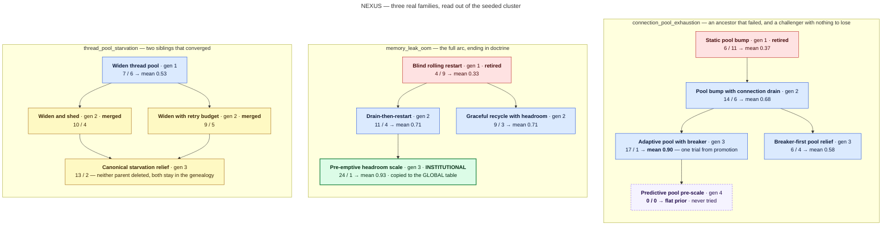
```mermaid
---
title: NEXUS — three real families, read out of the seeded cluster
config:
  flowchart:
    curve: basis
    wrappingWidth: 700
---
flowchart TB
    classDef act  fill:#dbeafe,stroke:#1d4ed8,color:#0b1a3a
    classDef new  fill:#f5f3ff,stroke:#8b5cf6,stroke-dasharray:4 3,color:#210b4a
    classDef inst fill:#dcfce7,stroke:#15803d,stroke-width:2px,color:#052e16
    classDef ret  fill:#fee2e2,stroke:#b91c1c,color:#450a0a
    classDef mrg  fill:#fef9c3,stroke:#a16207,color:#3b2606

    subgraph A["connection_pool_exhaustion — an ancestor that failed, and a challenger with nothing to lose"]
        direction TB
        A1["<b>Static pool bump</b> · gen 1 · <b>retired</b><br/>6 / 11 → mean 0.37"]
        A2["<b>Pool bump with connection drain</b> · gen 2<br/>14 / 6 → mean 0.68"]
        A3["<b>Adaptive pool with breaker</b> · gen 3<br/>17 / 1 → <b>mean 0.90</b> — one trial from promotion"]
        A4["<b>Breaker-first pool relief</b> · gen 3<br/>6 / 4 → mean 0.58"]
        A5["<b>Predictive pool pre-scale</b> · gen 4<br/><b>0 / 0 → flat prior</b> · never tried"]
        A1 --> A2 --> A3 --> A5
        A2 --> A4
    end

    subgraph B["memory_leak_oom — the full arc, ending in doctrine"]
        direction TB
        B1["<b>Blind rolling restart</b> · gen 1 · <b>retired</b><br/>4 / 9 → mean 0.33"]
        B2["<b>Drain-then-restart</b> · gen 2<br/>11 / 4 → mean 0.71"]
        B3["<b>Graceful recycle with headroom</b> · gen 2<br/>9 / 3 → mean 0.71"]
        B4["<b>Pre-emptive headroom scale</b> · gen 3 · <b>INSTITUTIONAL</b><br/>24 / 1 → mean 0.93 · copied to the GLOBAL table"]
        B1 --> B2 --> B4
        B1 --> B3
    end

    subgraph C["thread_pool_starvation — two siblings that converged"]
        direction TB
        C1["<b>Widen thread pool</b> · gen 1<br/>7 / 6 → mean 0.53"]
        C2["<b>Widen and shed</b> · gen 2 · <b>merged</b><br/>10 / 4"]
        C3["<b>Widen with retry budget</b> · gen 2 · <b>merged</b><br/>9 / 5"]
        C4["<b>Canonical starvation relief</b> · gen 3<br/>13 / 2 — neither parent deleted, both stay in the genealogy"]
        C1 --> C2 --> C4
        C1 --> C3 --> C4
    end

    class A2,A3,A4,B2,B3,C1 act
    class A5 new
    class A1,B1 ret
    class B4 inst
    class C2,C3,C4 mrg
```

Read left to right, that is the whole thesis in data: a founder that failed and was retired
but is still in the tree; a lineage that improved across generations; two convergent
siblings replaced by one canonical child with both parents preserved; a genome promoted into
institutional doctrine; and a zero-trial challenger sitting on a flat prior, waiting for the
sampler to give it a turn.

Shadow scoring settles the two halves of a shadow record separately. The prediction becomes
`missed` or `false_alarm`; the playbook is scored only when there is something real to
compare it against, and **never merely because the predicted failure failed to arrive**.
`success_count` is an integer and a shadow trial is worth 0.3, so the fraction accrues in the
append-only log and banks a whole trial every 3⅓ observations.

---

## 10 · The nervous system

Changefeed delivery is at-least-once. That is the contract, not a defect to be worked around.

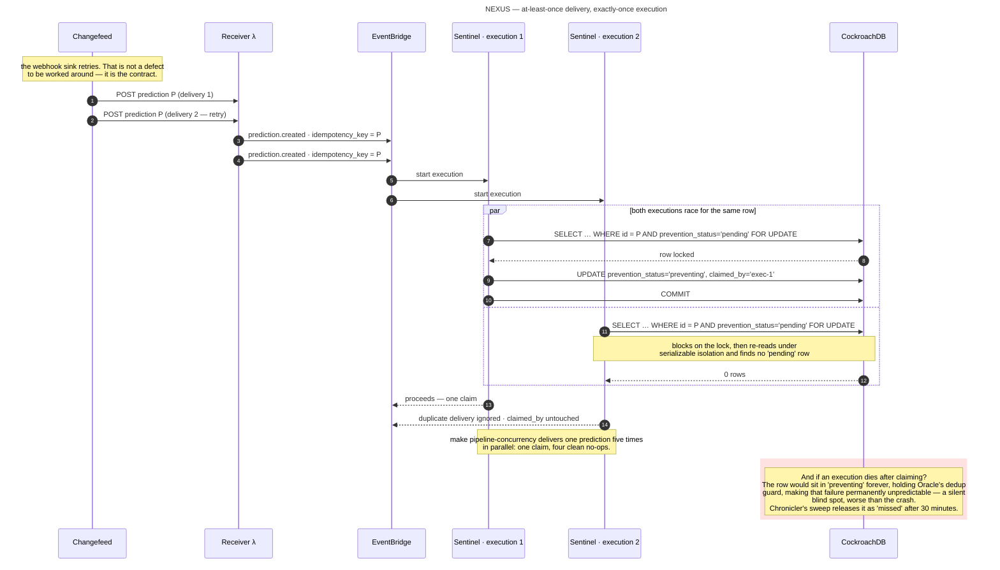
```mermaid
---
title: NEXUS — at-least-once delivery, exactly-once execution
---
sequenceDiagram
    autonumber
    participant CF as Changefeed
    participant R as Receiver λ
    participant EB as EventBridge
    participant S1 as Sentinel · execution 1
    participant S2 as Sentinel · execution 2
    participant DB as CockroachDB

    Note over CF: the webhook sink retries. That is not a defect<br/>to be worked around — it is the contract.
    CF->>R: POST prediction P (delivery 1)
    CF->>R: POST prediction P (delivery 2 — retry)
    R->>EB: prediction.created · idempotency_key = P
    R->>EB: prediction.created · idempotency_key = P
    EB->>S1: start execution
    EB->>S2: start execution

    par both executions race for the same row
        S1->>DB: SELECT … WHERE id = P AND prevention_status='pending' FOR UPDATE
        DB-->>S1: row locked
        S1->>DB: UPDATE prevention_status='preventing', claimed_by='exec-1'
        S1->>DB: COMMIT
    and
        S2->>DB: SELECT … WHERE id = P AND prevention_status='pending' FOR UPDATE
        Note over S2,DB: blocks on the lock, then re-reads under<br/>serializable isolation and finds no 'pending' row
        DB-->>S2: 0 rows
    end

    S1-->>EB: proceeds — one claim
    S2-->>EB: duplicate delivery ignored · claimed_by untouched

    Note over S1,S2: make pipeline-concurrency delivers one prediction five times<br/>in parallel: one claim, four clean no-ops.

    rect rgb(254, 226, 226)
    Note over DB: And if an execution dies after claiming?<br/>The row would sit in 'preventing' forever, holding Oracle's dedup<br/>guard, making that failure permanently unpredictable — a silent<br/>blind spot, worse than the crash.<br/>Chronicler's sweep releases it as 'missed' after 30 minutes.
    end
```

`make pipeline-concurrency` delivers one prediction five times in parallel and asserts one
claim and four clean no-ops.

---

## 11 · Multi-region

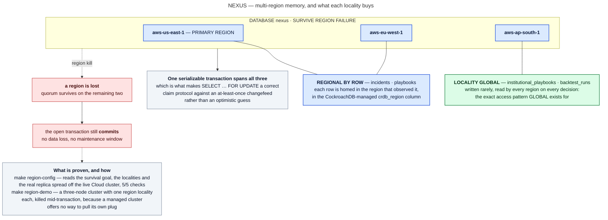
```mermaid
---
title: NEXUS — multi-region memory, and what each locality buys
config:
  flowchart:
    curve: basis
    wrappingWidth: 700
---
flowchart TB
    classDef reg  fill:#dbeafe,stroke:#1d4ed8,stroke-width:1.5px,color:#0b1a3a
    classDef glob fill:#dcfce7,stroke:#15803d,stroke-width:1.5px,color:#052e16
    classDef dead fill:#fee2e2,stroke:#b91c1c,color:#450a0a
    classDef note fill:#f1f5f9,stroke:#64748b,color:#0f172a

    subgraph DBSC["DATABASE nexus · SURVIVE REGION FAILURE"]
        direction TB
        R1["<b>aws-us-east-1</b> — PRIMARY REGION"]
        R2["<b>aws-eu-west-1</b>"]
        R3["<b>aws-ap-south-1</b>"]
    end

    RBR["<b>REGIONAL BY ROW</b> — incidents · playbooks<br/>each row is homed in the region that observed it,<br/>in the CockroachDB-managed crdb_region column"]
    GLB["<b>LOCALITY GLOBAL</b> — institutional_playbooks · backtest_runs<br/>written rarely, read by every region on every decision:<br/>the exact access pattern GLOBAL exists for"]
    SER["<b>One serializable transaction spans all three</b><br/>which is what makes SELECT … FOR UPDATE a correct<br/>claim protocol against an at-least-once changefeed<br/>rather than an optimistic guess"]

    KILL["<b>a region is lost</b><br/>quorum survives on the remaining two"]
    OUT["the open transaction still <b>commits</b><br/>no data loss, no maintenance window"]

    R1 --- RBR
    R2 --- RBR
    R3 --- GLB
    DBSC --> SER
    DBSC -. "region kill" .-> KILL --> OUT

    PROOF["<b>What is proven, and how</b><br/>make region-config — reads the survival goal, the localities and<br/>the real replica spread off the live Cloud cluster, 5/5 checks<br/>make region-demo — a three-node cluster with one region locality<br/>each, killed mid-transaction, because a managed cluster<br/>offers no way to pull its own plug"]

    OUT -.-> PROOF

    class R1,R2,R3 reg
    class RBR reg
    class GLB glob
    class KILL,OUT dead
    class SER,PROOF note
```

Four things are load-bearing here, and only one of them is vector search:

1. **`AS OF SYSTEM TIME`** gives the provenance replay for free out of MVCC.
2. **`SURVIVE REGION FAILURE` with `REGIONAL BY ROW`** homes each incident in the region that
   observed it while keeping one serializable transaction across all three.
3. **`LOCALITY GLOBAL`** puts promoted institutional playbooks in every region's local read
   path — written rarely, read on every decision.
4. **Serializable by default** is what makes `FOR UPDATE` a correct claim protocol against an
   at-least-once changefeed rather than an optimistic guess.

---

## 12 · Deployment

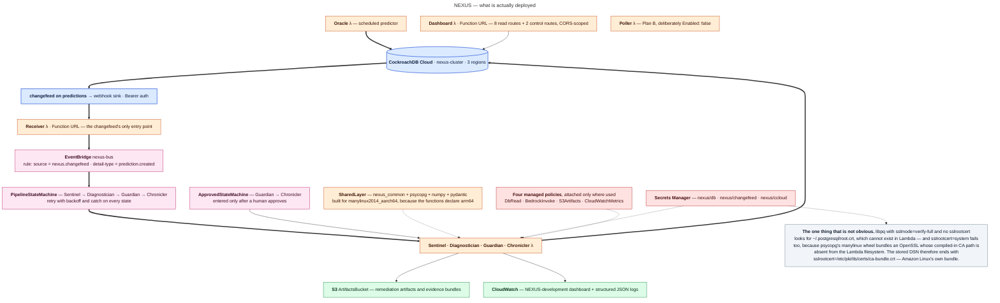
```mermaid
---
title: NEXUS — what is actually deployed
config:
  flowchart:
    curve: basis
    wrappingWidth: 700
    rankSpacing: 55
---
flowchart TB
    classDef lam  fill:#ffedd5,stroke:#c2410c,color:#3b1206
    classDef evt  fill:#fce7f3,stroke:#be185d,color:#3f0a24
    classDef sec  fill:#fee2e2,stroke:#b91c1c,color:#450a0a
    classDef sto  fill:#dcfce7,stroke:#15803d,color:#052e16
    classDef db   fill:#dbeafe,stroke:#1d4ed8,stroke-width:1.5px,color:#0b1a3a
    classDef note fill:#f1f5f9,stroke:#64748b,color:#0f172a

    CRDB[("<b>CockroachDB Cloud</b> · nexus-cluster · 3 regions")]
    CFD["<b>changefeed on predictions</b> → webhook sink · Bearer auth"]
    RCV["<b>Receiver</b> λ · Function URL — the changefeed's only entry point"]
    BUS["<b>EventBridge</b> nexus-bus<br/>rule: source = nexus.changefeed · detail-type = prediction.created"]
    SM1["<b>PipelineStateMachine</b> — Sentinel → Diagnostician → Guardian → Chronicler<br/>retry with backoff and catch on every state"]
    SM2["<b>ApprovedStateMachine</b> — Guardian → Chronicler<br/>entered only after a human approves"]
    PIPE["<b>Sentinel · Diagnostician · Guardian · Chronicler</b> λ"]
    ORA["<b>Oracle</b> λ — scheduled predictor"]
    DASH["<b>Dashboard</b> λ · Function URL — 8 read routes + 2 control routes, CORS-scoped"]
    POLL["<b>Poller</b> λ — Plan B, deliberately Enabled: false"]

    LAYER["<b>SharedLayer</b> — nexus_common + psycopg + numpy + pydantic<br/>built for manylinux2014_aarch64, because the functions declare arm64"]
    SEC["<b>Secrets Manager</b> — nexus/db · nexus/changefeed · nexus/ccloud"]
    IAM["<b>Four managed policies</b>, attached only where used<br/>DbRead · BedrockInvoke · S3Artifacts · CloudWatchMetrics"]
    S3["<b>S3</b> ArtifactsBucket — remediation artifacts and evidence bundles"]
    CW["<b>CloudWatch</b> — NEXUS-development dashboard + structured JSON logs"]

    TLS["<b>The one thing that is not obvious.</b> libpq with sslmode=verify-full and no sslrootcert<br/>looks for ~/.postgresql/root.crt, which cannot exist in Lambda — and sslrootcert=system fails<br/>too, because psycopg's manylinux wheel bundles an OpenSSL whose compiled-in CA path is<br/>absent from the Lambda filesystem. The stored DSN therefore ends with<br/>sslrootcert=/etc/pki/tls/certs/ca-bundle.crt — Amazon Linux's own bundle."]

    CRDB ==> CFD ==> RCV ==> BUS ==> SM1 ==> PIPE
    SM2 --> PIPE
    PIPE ==> CRDB
    ORA ==> CRDB
    DASH --> CRDB
    PIPE --> S3
    PIPE --> CW
    LAYER -.-> PIPE
    SEC -.-> PIPE
    IAM -.-> PIPE
    SEC -.-> TLS

    class CRDB,CFD db
    class RCV,PIPE,ORA,DASH,POLL,LAYER lam
    class BUS,SM1,SM2 evt
    class SEC,IAM sec
    class S3,CW sto
    class TLS note
```

The exit gate this closes is the one that matters: an `INSERT` into `predictions` on the live
Cloud cluster produces a Step Functions execution that reaches `SUCCEEDED` across Sentinel →
Diagnostician → Guardian → Chronicler, and replaying the same webhook payload produces
`duplicate delivery ignored` with `claimed_by` untouched.

---

## 13 · Security


```mermaid
---
title: NEXUS — trust boundaries and least privilege
config:
  flowchart:
    curve: basis
    wrappingWidth: 700
---
flowchart TB
    classDef trust   fill:#dcfce7,stroke:#15803d,color:#052e16
    classDef bound   fill:#fef9c3,stroke:#a16207,color:#3b2606
    classDef untrust fill:#fee2e2,stroke:#b91c1c,color:#450a0a
    classDef ctl     fill:#dbeafe,stroke:#1d4ed8,color:#0b1a3a
    classDef note    fill:#f1f5f9,stroke:#64748b,color:#0f172a

    subgraph U["UNTRUSTED — content a model produced"]
        direction TB
        GEN["A genome proposed by Bedrock<br/>birth · mutation · merge"]
    end

    subgraph V["THE ONE GATE — nexus_common.steps.PlaybookDraft"]
        direction TB
        VAL["pydantic, extra='forbid'<br/>action must be one of 20 · target required · 1–12 steps<br/>an inverse must itself be a known action"]
        REJ["<b>Rejected</b> — unknown action, missing target, invented field,<br/>prose instead of JSON. Logged with its payload.<br/>A malformed genome is stillborn: never inserted, never executed."]
    end

    subgraph T["TRUSTED — only validated structure reaches these"]
        direction TB
        DBW["INSERT INTO playbooks"]
        EXE["Guardian executes against the fleet"]
    end

    CRED["<b>Credentials</b><br/>Secrets Manager, read at cold start, cached per environment<br/>nothing in code, nothing in git history<br/>.env is gitignored and stays that way"]
    ROT["<b>Rotation is two steps, not one.</b> get_secret is @functools.cache'd and<br/>the pool is a module global, so a warm environment serves the old value<br/>forever. Writing a new version has no effect until every function is cycled."]

    IAMP["<b>Per-function IAM</b> — four managed policies, attached only where used<br/>DbRead: secretsmanager:GetSecretValue on three named secret ARNs<br/>BedrockInvoke: InvokeModel on the two model ARNs<br/>S3Artifacts: Get/Put on the bucket, not on S3<br/>CloudWatchMetrics: PutMetricData, which has no resource-level scope"]
    DEPLOY["<b>Deploy identity</b> — a scoped IAM user, not root keys<br/>CloudFormation limited to stack/nexus/*, the artifact bucket pinned<br/>so no second managed stack is needed"]
    WEBH["<b>Webhook</b> — Bearer shared secret on the changefeed sink<br/>the receiver rejects anything else before parsing a byte"]
    CC["<b>ccloud</b> — a service account scoped CLUSTER_DEVELOPER<br/>read and connect, no cluster mutation, read-only again in the argv"]
    SQLU["<b>Database</b> — a least-privilege app user, never admin"]

    GEN --> VAL
    VAL -- "fails" --> REJ
    VAL -- "passes" --> DBW --> EXE
    CRED -.-> ROT

    class GEN untrust
    class VAL,REJ bound
    class DBW,EXE trust
    class CRED,IAMP,DEPLOY,WEBH,CC,SQLU ctl
    class ROT note
```

Model output is treated as untrusted input, because it is. The gate is one pydantic model
with `extra="forbid"`, shared by every path that can produce a genome — the seed generator
authors against it, Bedrock is required to emit it, Chronicler mutates within it, and Guardian
executes only what has passed it. Four components agreeing on a schema is not a convention
here; it is a single class.

---

## 14 · Failure semantics

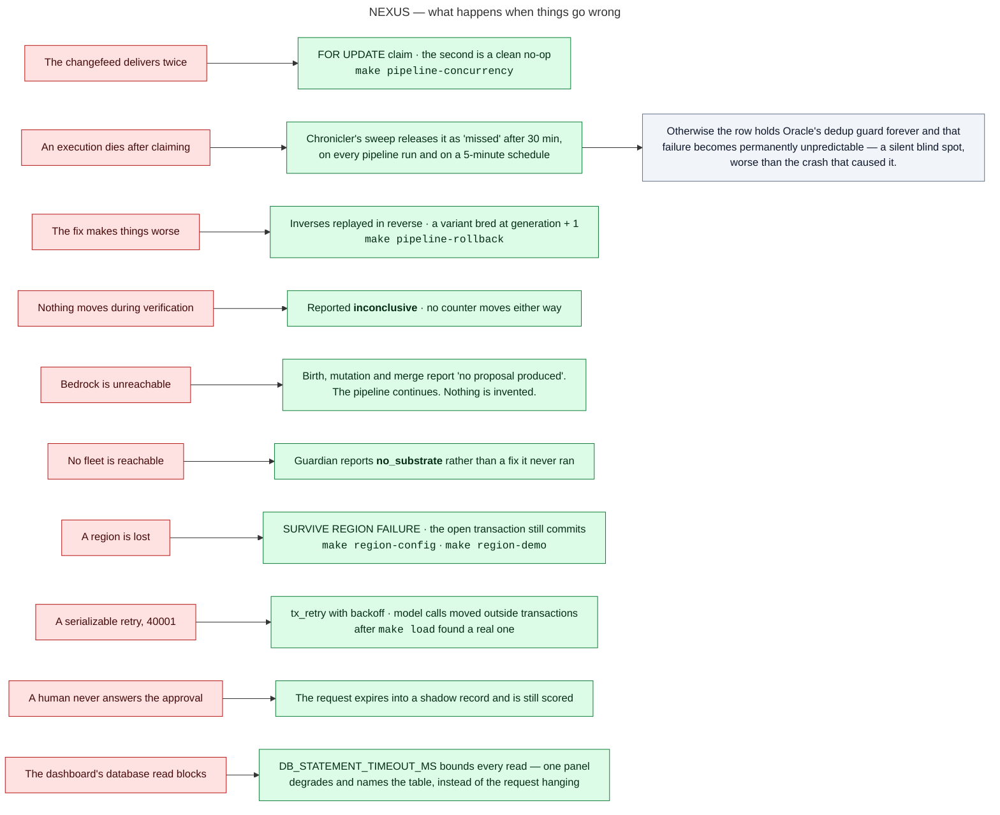
```mermaid
---
title: NEXUS — what happens when things go wrong
config:
  flowchart:
    curve: basis
    wrappingWidth: 700
---
flowchart LR
    classDef fail fill:#fee2e2,stroke:#b91c1c,color:#450a0a
    classDef resp fill:#dcfce7,stroke:#15803d,color:#052e16
    classDef why  fill:#f1f5f9,stroke:#64748b,color:#0f172a

    F1["The changefeed delivers twice"]
    R1["FOR UPDATE claim · the second is a clean no-op<br/><code>make pipeline-concurrency</code>"]

    F2["An execution dies after claiming"]
    R2["Chronicler's sweep releases it as 'missed' after 30 min,<br/>on every pipeline run and on a 5-minute schedule"]
    W2["Otherwise the row holds Oracle's dedup guard forever and that<br/>failure becomes permanently unpredictable — a silent blind spot,<br/>worse than the crash that caused it."]

    F3["The fix makes things worse"]
    R3["Inverses replayed in reverse · a variant bred at generation + 1<br/><code>make pipeline-rollback</code>"]

    F4["Nothing moves during verification"]
    R4["Reported <b>inconclusive</b> · no counter moves either way"]

    F5["Bedrock is unreachable"]
    R5["Birth, mutation and merge report 'no proposal produced'.<br/>The pipeline continues. Nothing is invented."]

    F6["No fleet is reachable"]
    R6["Guardian reports <b>no_substrate</b> rather than a fix it never ran"]

    F7["A region is lost"]
    R7["SURVIVE REGION FAILURE · the open transaction still commits<br/><code>make region-config</code> · <code>make region-demo</code>"]

    F8["A serializable retry, 40001"]
    R8["tx_retry with backoff · model calls moved outside transactions<br/>after <code>make load</code> found a real one"]

    F9["A human never answers the approval"]
    R9["The request expires into a shadow record and is still scored"]

    F10["The dashboard's database read blocks"]
    R10["DB_STATEMENT_TIMEOUT_MS bounds every read — one panel<br/>degrades and names the table, instead of the request hanging"]

    F1 --> R1
    F2 --> R2 --> W2
    F3 --> R3
    F4 --> R4
    F5 --> R5
    F6 --> R6
    F7 --> R7
    F8 --> R8
    F9 --> R9
    F10 --> R10

    class F1,F2,F3,F4,F5,F6,F7,F8,F9,F10 fail
    class R1,R2,R3,R4,R5,R6,R7,R8,R9,R10 resp
    class W2 why
```

The pattern across all of these is the same: **the honest failure is the better answer.**
Guardian reporting `no_substrate` is more useful than a tunnel that makes the beat "work".
"No proposal produced" is more useful than an invented playbook. `inconclusive` is more useful
than a flattering win.

---

## 15 · Verification

Nothing in this repository is marked complete on the strength of the code existing.

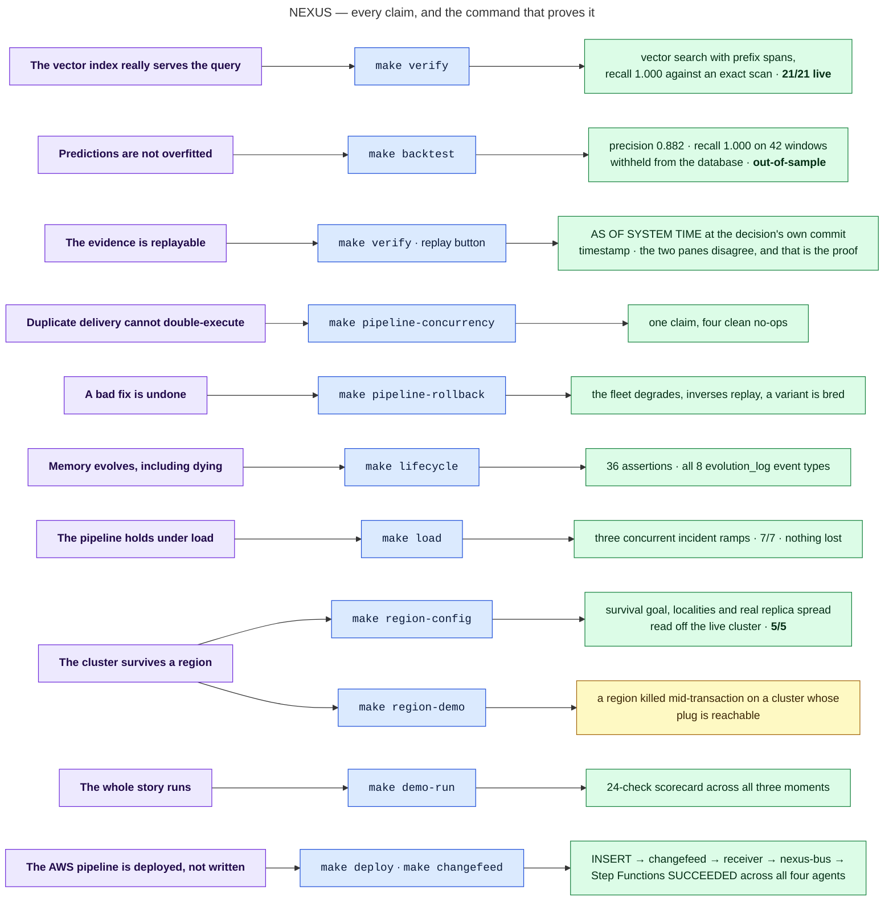
```mermaid
---
title: NEXUS — every claim, and the command that proves it
config:
  flowchart:
    curve: basis
    wrappingWidth: 700
---
flowchart LR
    classDef claim fill:#ede9fe,stroke:#6d28d9,color:#210b4a
    classDef cmd   fill:#dbeafe,stroke:#1d4ed8,color:#0b1a3a
    classDef ok    fill:#dcfce7,stroke:#15803d,color:#052e16
    classDef part  fill:#fef9c3,stroke:#a16207,color:#3b2606
    classDef no    fill:#fee2e2,stroke:#b91c1c,color:#450a0a

    C1["<b>The vector index really serves the query</b>"] --> M1["<code>make verify</code>"] --> E1["vector search with prefix spans,<br/>recall 1.000 against an exact scan · <b>21/21 live</b>"]
    C2["<b>Predictions are not overfitted</b>"] --> M2["<code>make backtest</code>"] --> E2["precision 0.882 · recall 1.000 on 42 windows<br/>withheld from the database · <b>out-of-sample</b>"]
    C3["<b>The evidence is replayable</b>"] --> M3["<code>make verify</code> · replay button"] --> E3["AS OF SYSTEM TIME at the decision's own commit<br/>timestamp · the two panes disagree, and that is the proof"]
    C4["<b>Duplicate delivery cannot double-execute</b>"] --> M4["<code>make pipeline-concurrency</code>"] --> E4["one claim, four clean no-ops"]
    C5["<b>A bad fix is undone</b>"] --> M5["<code>make pipeline-rollback</code>"] --> E5["the fleet degrades, inverses replay, a variant is bred"]
    C6["<b>Memory evolves, including dying</b>"] --> M6["<code>make lifecycle</code>"] --> E6["36 assertions · all 8 evolution_log event types"]
    C7["<b>The pipeline holds under load</b>"] --> M7["<code>make load</code>"] --> E7["three concurrent incident ramps · 7/7 · nothing lost"]
    C8["<b>The cluster survives a region</b>"] --> M8["<code>make region-config</code>"] --> E8["survival goal, localities and real replica spread<br/>read off the live cluster · <b>5/5</b>"]
    C8 --> M9["<code>make region-demo</code>"] --> E9["a region killed mid-transaction on a cluster whose<br/>plug is reachable"]
    C9["<b>The whole story runs</b>"] --> M10["<code>make demo-run</code>"] --> E10["24-check scorecard across all three moments"]
    C10["<b>The AWS pipeline is deployed, not written</b>"] --> M11["<code>make deploy</code> · <code>make changefeed</code>"] --> E11["INSERT → changefeed → receiver → nexus-bus →<br/>Step Functions SUCCEEDED across all four agents"]

    class C1,C2,C3,C4,C5,C6,C7,C8,C9,C10 claim
    class M1,M2,M3,M4,M5,M6,M7,M8,M9,M10,M11 cmd
    class E1,E2,E3,E4,E5,E6,E7,E8,E10,E11 ok
    class E9 part
```

Plus, on every push, without a cluster: **242 unit tests**, ruff, `sam validate --lint`, the
state-machine definitions, and the frontend build. The line is deliberate — the exit gates
talk to a live three-region cluster, and wiring those credentials into a public runner to
prove a hackathon claim is a worse trade than running them by hand and recording what
happened.

---

## 16 · The synthetic world

A demo becomes an experiment when part of the world is withheld from it.

```
 baseline ────► precursor drift ────► failure ────► recovery
  45 min         60–180 min            20 min        40 min
                 ▲                     ▲
                 │                     └── incidents.symptom_embedding
                 └── precursor_snapshots.trajectory_embedding
                     — what Oracle matches. The failure is never in it.
```

`world.build(seed, anchor)` is a pure function: the same seed rebuilds the identical world
down to the last sample, which is what makes `make demo-reset` restore the exact state the
demo was rehearsed against.

| | Seeded into the database | Withheld |
|---|---|---|
| Incidents | 120 | — |
| Precursor snapshots | 155 — **120 that failed, 35 that recovered on their own** | — |
| Playbooks across 4 generations | 30 | — |
| Institutional playbooks | 1 | — |
| `evolution_log` events | 185 | — |
| Held-out windows → `demo/backtest_set.jsonl` | — | **42** |

`telemetry_embeddings` is intentionally left empty by the seed: it has a 2-hour TTL, so
seeding it would be seeding something that evaporates. `make live` fills it through the same
ingestion path real telemetry would use.

**Remediation is modelled as a counter-force on the same axis.** An effective step slows the
drift, a full playbook reverses it, a mismatched step accelerates it. That is why the bad-fix
rollback is a *consequence of the simulation* rather than a scripted animation.

Eight archetypes, four services, three regions:

`connection_pool_exhaustion` · `memory_leak_oom` · `cache_stampede` · `cert_expiry` ·
`disk_full` · `bad_deploy_latency_regression` · `thread_pool_starvation` · `dns_timeout_cascade`

---

## 17 · The technology surface

One row per agent: the AWS service that runs it, and the CockroachDB capability it thinks
with.

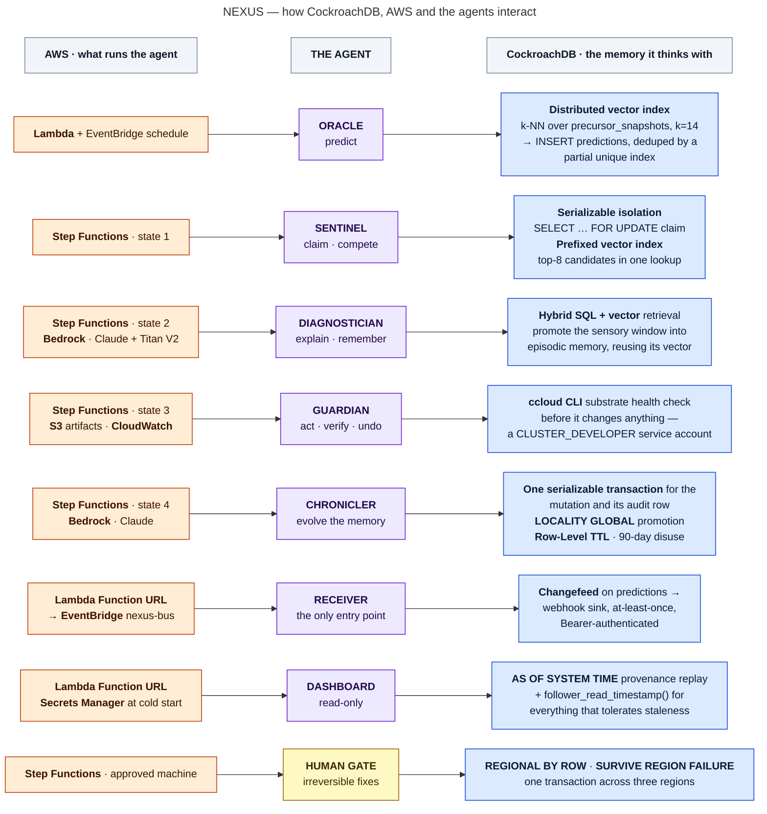
```mermaid
---
title: NEXUS — how CockroachDB, AWS and the agents interact
config:
  flowchart:
    curve: basis
    wrappingWidth: 700
    nodeSpacing: 30
    rankSpacing: 90
---
flowchart LR
    classDef aws  fill:#ffedd5,stroke:#c2410c,stroke-width:1.2px,color:#3b1206
    classDef ag   fill:#ede9fe,stroke:#6d28d9,stroke-width:1.2px,color:#210b4a
    classDef crdb fill:#dbeafe,stroke:#1d4ed8,stroke-width:1.2px,color:#0b1a3a
    classDef hum  fill:#fef9c3,stroke:#a16207,stroke-width:1.2px,color:#3b2606
    classDef hdr  fill:#f1f5f9,stroke:#64748b,stroke-width:1px,color:#0f172a

    HA["<b>AWS · what runs the agent</b>"]:::hdr
    HB["<b>THE AGENT</b>"]:::hdr
    HC["<b>CockroachDB · the memory it thinks with</b>"]:::hdr
    HA ~~~ HB ~~~ HC

    A1["<b>Lambda</b> + EventBridge schedule"] --> G1["<b>ORACLE</b><br/>predict"] --> C1["<b>Distributed vector index</b><br/>k-NN over precursor_snapshots, k=14<br/>→ INSERT predictions, deduped by a<br/>partial unique index"]

    A2["<b>Step Functions</b> · state 1"] --> G2["<b>SENTINEL</b><br/>claim · compete"] --> C2["<b>Serializable isolation</b><br/>SELECT … FOR UPDATE claim<br/><b>Prefixed vector index</b><br/>top-8 candidates in one lookup"]

    A3["<b>Step Functions</b> · state 2<br/><b>Bedrock</b> · Claude + Titan V2"] --> G3["<b>DIAGNOSTICIAN</b><br/>explain · remember"] --> C3["<b>Hybrid SQL + vector</b> retrieval<br/>promote the sensory window into<br/>episodic memory, reusing its vector"]

    A4["<b>Step Functions</b> · state 3<br/><b>S3</b> artifacts · <b>CloudWatch</b>"] --> G4["<b>GUARDIAN</b><br/>act · verify · undo"] --> C4["<b>ccloud CLI</b> substrate health check<br/>before it changes anything —<br/>a CLUSTER_DEVELOPER service account"]

    A5["<b>Step Functions</b> · state 4<br/><b>Bedrock</b> · Claude"] --> G5["<b>CHRONICLER</b><br/>evolve the memory"] --> C5["<b>One serializable transaction</b> for the<br/>mutation and its audit row<br/><b>LOCALITY GLOBAL</b> promotion<br/><b>Row-Level TTL</b> · 90-day disuse"]

    A6["<b>Lambda Function URL</b><br/>→ <b>EventBridge</b> nexus-bus"] --> G6["<b>RECEIVER</b><br/>the only entry point"] --> C6["<b>Changefeed</b> on predictions →<br/>webhook sink, at-least-once,<br/>Bearer-authenticated"]

    A7["<b>Lambda Function URL</b><br/><b>Secrets Manager</b> at cold start"] --> G7["<b>DASHBOARD</b><br/>read-only"] --> C7["<b>AS OF SYSTEM TIME</b> provenance replay<br/>+ follower_read_timestamp&lpar;&rpar; for<br/>everything that tolerates staleness"]

    A8["<b>Step Functions</b> · approved machine"] --> G8["<b>HUMAN GATE</b><br/>irreversible fixes"] --> C8["<b>REGIONAL BY ROW</b> · <b>SURVIVE REGION FAILURE</b><br/>one transaction across three regions"]

    class A1,A2,A3,A4,A5,A6,A7,A8 aws
    class G1,G2,G3,G4,G5,G6,G7 ag
    class G8 hum
    class C1,C2,C3,C4,C5,C6,C7,C8 crdb
```

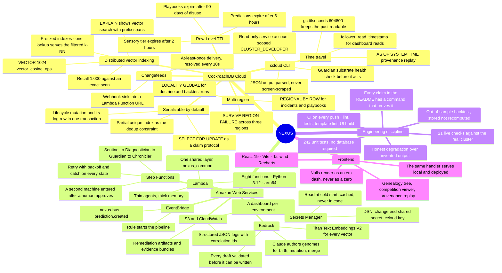
```mermaid
---
title: NEXUS — the technology surface
---
mindmap
  root(("NEXUS"))
    CockroachDB Cloud
      Distributed vector indexing
        VECTOR 1024 · vector_cosine_ops
        Prefixed indexes · one lookup serves the filtered k-NN
        EXPLAIN shows vector search with prefix spans
        Recall 1.000 against an exact scan
      Time travel
        AS OF SYSTEM TIME provenance replay
        follower_read_timestamp for dashboard reads
        gc.ttlseconds 604800 keeps the past readable
      Multi-region
        SURVIVE REGION FAILURE across three regions
        REGIONAL BY ROW for incidents and playbooks
        LOCALITY GLOBAL for doctrine and backtest runs
      Serializable by default
        SELECT FOR UPDATE as a claim protocol
        Partial unique index as the dedup constraint
        Lifecycle mutation and its log row in one transaction
      Changefeeds
        Webhook sink into a Lambda Function URL
        At-least-once delivery, resolved every 10s
      Row-Level TTL
        Sensory tier expires after 2 hours
        Predictions expire after 6 hours
        Playbooks expire after 90 days of disuse
      ccloud CLI
        Guardian substrate health check before it acts
        Read-only service account scoped CLUSTER_DEVELOPER
        JSON output parsed, never screen-scraped
    Amazon Web Services
      Lambda
        Eight functions · Python 3.12 · arm64
        One shared layer, nexus_common
        Thin agents, thick memory
      Step Functions
        Sentinel to Diagnostician to Guardian to Chronicler
        A second machine entered after a human approves
        Retry with backoff and catch on every state
      EventBridge
        nexus-bus · prediction.created
        Rule starts the pipeline
      Bedrock
        Titan Text Embeddings V2 for every vector
        Claude authors genomes for birth, mutation, merge
        Every draft validated before it can be written
      S3 and CloudWatch
        Remediation artifacts and evidence bundles
        Structured JSON logs with correlation ids
        A dashboard per environment
      Secrets Manager
        DSN, changefeed shared secret, ccloud key
        Read at cold start, cached, never in code
    Engineering discipline
      242 unit tests, no database required
      21 live checks against the real cluster
      Out-of-sample backtest, stored not recomputed
      CI on every push · lint, tests, template lint, UI build
      Honest degradation over invented output
      Every claim in the README has a command that proves it
    Frontend
      React 19 · Vite · Tailwind · Recharts
      Genealogy tree, competition viewer, provenance replay
      Nulls render as an em dash, never as a zero
      The same handler serves local and deployed
```

---

## 18 · Repository map

```
sql/               numbered idempotent migrations, 000_regions → 006_backtest_runs,
                   plus changefeed.sql
layers/shared/     the Lambda layer: nexus_common {db, bedrock, embeddings, trajectory,
                   steps, posterior, metrics, fleet_client, log, config} + an explicit
                   arm64 build Makefile
agents/            thin Lambda bodies: oracle, sentinel, diagnostician, guardian,
                   chronicler, receiver, poller, dashboard
infra/             SAM template, samconfig, and two Step Functions definitions —
                   nexus.asl.json and approved.asl.json (entered after a human approves)
generator/         the synthetic world: archetypes, trajectory synthesis, seeded
                   population and genealogy, live fleet simulator + ramp control API
scripts/           migrate · seed · verify_phase2 · pipeline_local · lifecycle_local ·
                   backtest · load_local · region_demo · demo_check · demo_run ·
                   dashboard_local · smoke_test
tests/             242 unit tests for the memory core and every agent — no database
frontend/          React + Vite + Tailwind + Recharts + react-flow, five views
diagrams/          the .mmd sources for every diagram in this document, plus rendered SVG
demo/              runbook, demo script, judge Q&A, region-kill compose file
```

### The shared layer

| Module | Provides |
|---|---|
| `config.py` | Env config + lazily cached Secrets Manager access, with an env-var fallback so `scripts/` work with no AWS |
| `db.py` | psycopg3 pool reused across warm invokes · `query_at()` for `AS OF SYSTEM TIME` · `tx_retry()` for 40001 · `commit_timestamp()` for provenance |
| `bedrock.py` | Titan V2 `embed()` asserting the 1024-dim output matches the schema, `claude()`, bounded retry/backoff |
| `embeddings.py` | The front door every embedding goes through; `provider_name()` is recorded in the seed manifest |
| `trajectory.py` | `trajectory_text()`, `METRIC_SCALES`, `metric_digest()` — the canonical ruler |
| `posterior.py` | Beta mean and credible intervals, computed, never stored |
| `steps.py` | The `{action, target, params, inverse}` schema, the action vocabulary, the rollback-program builder |
| `fleet_client.py` | The typed client for the fleet control API |
| `metrics.py` · `log.py` | CloudWatch metrics and structured JSON logs carrying incident/prediction/playbook ids |

---

## 19 · Locked decisions

- **Embedding dimension 1024** — Titan Text Embeddings V2's default, *not* 1536. Every
  `VECTOR` column and index.
- **`vector_cosine_ops`** so the `<=>` cosine operator is index-accelerated.
- **Python 3.12 · arm64 · AWS SAM.** The layer is built explicitly for
  `manylinux2014_aarch64`, because SAM's default builder image is x86_64 and the resulting
  wheels fail at import with `no pq wrapper available`.
- **`institutional_playbooks` is a separate `GLOBAL` table**, not a flag on `playbooks`.
- **Migrations run in autocommit** — CockroachDB DDL cannot run inside an explicit
  transaction — and are idempotent via `schema_migrations` + `IF NOT EXISTS`.
- **`DELETE`, never `TRUNCATE`, on reset.** `TRUNCATE` recreates a table under a new ID and
  **discards its zone config**, which is how `precursor_snapshots` once silently inherited a
  75-minute GC window instead of the configured 7 days. The provenance replay kept passing,
  because a replay runs seconds after its decision. `make seed` re-asserts the zone configs
  and `make verify` now checks the window on both tables.
- **Secrets in Secrets Manager, read at cold start.** And rotation is *two* steps — see §13.
- **One serialization function.** A window is embedded via `trajectory_text()` and nothing
  else.

---

## 20 · What is not built

| Gap | Status |
|---|---|
| **Bedrock-authored genomes** | Written and unit-tested; **blocked on account-level model access**. Titan V2 and Claude both return `ValidationException: Operation not allowed` with IAM verified correct. Birth, mutation and merge log and decline rather than fabricating. `make lifecycle` substitutes one seam and stamps `proposed_by: "lifecycle-harness"` — never `"bedrock"`. |
| **Region kill, demonstrated** | `make region-config` proves the configuration live, 5/5. `make region-demo` is written and **not yet exercised**. |
| **Guardian in the deployed pipeline** | Reports `no_substrate` on purpose: the fleet is a local simulator with no public URL. |
| **CockroachDB Managed MCP Server** | Not configured. The two CockroachDB tools in use are **Distributed Vector Indexing** and the **ccloud CLI**. |
| **Agent Skills** | Pre-decided scope cut. |
| **Unprefixed vector index** | Removed; Oracle's uncategorized neighbourhood query falls back to a scan. See §4. |
| **10k-row load and TTL-reap checks** | Environment-limited — bulk vector writes run at ~2.6 rows/s over this link. |
| **Calibration in the 0.60–0.70 bucket** | Real, visible, and left on screen. Fixing it means reweighting the prior against neighbour similarity, which is a change worth measuring rather than guessing. |
| **ccloud inside Lambda** | `substrate_health()` shells to a binary the layer does not ship, so in Lambda it reports `available: false` with the real reason. Exercised locally, which is where the demo runs. |

<div align="center">

---

**Every claim in this document has a command in [§15](#15--verification) that proves it, or a
line in [§20](#20--what-is-not-built) that says it does not.**

</div>
