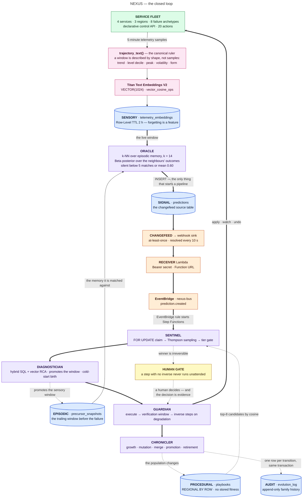
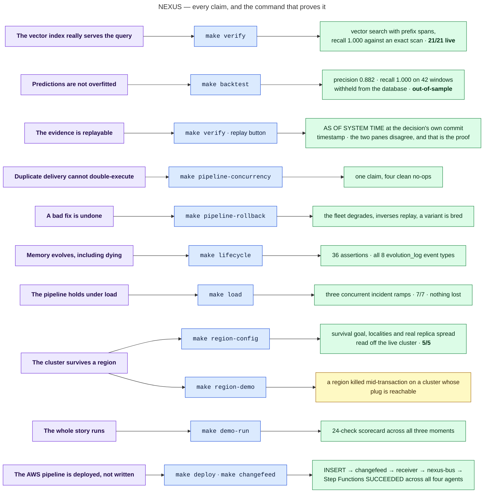

<div align="center">

# NEXUS

### Darwinian memory evolution for AI agents

**Infrastructure that remembers, predicts, heals — and evolves.**
Operational knowledge with a family tree: playbooks that are born, compete by Thompson sampling, mutate from their own failure, promote or retire by Darwinian selection.

<br/>

`CockroachDB Cloud · 3 regions · SURVIVE REGION FAILURE`  ·  `AWS Lambda · Step Functions · EventBridge · Bedrock · S3`
`VECTOR(1024) · vector_cosine_ops`  ·  `Python 3.12 · arm64 · SAM`  ·  `React 19 · Vite`

<br/>

**[Architecture](ARCHITECTURE.md)** · **[Run it](demo/README.md)** · **[Diagram gallery](diagrams/)**

</div>

---

## About in short.

NEXUS inverts that: **retrieval *is* the decision.**
A telemetry trajectory is embedded and matched against the trajectories of past incidents, and
the k nearest neighbours' outcomes *are* the parameters of a Beta posterior that decides whether
to predict, whether to act, and which remediation gets the turn. No language model is in that
path at all. A model appears in exactly three places, all of them authoring a new playbook
genome: **birth, mutation, merge.** Everything else is vector search and arithmetic over
columns — which is why there is a number for it.

```bash
cp .env.example .env      # fill in COCKROACH_DB_URL
make seed                 # build the whole world from cold (~4 min)
make demo-run             # the entire story, headless, with a 24-check scorecard
```

---

## The closed loop



<sub>All 18 diagrams in this repository have `.mmd` sources and rendered SVGs in **[`diagrams/`](diagrams/)**.</sub>

---

## AWS & CockroachDB tools — what the agent actually does with them

### CockroachDB — two tools, used by agent code

**1 · Distributed Vector Indexing** — this is the entire retrieval path, not a feature demo.

- `VECTOR(1024)` columns on five tables, indexed with `vector_cosine_ops` so `<=>` is
  index-accelerated.
- **Prefixed** vector indexes (`(outcome_category, status, embedding)`) so the hybrid
  `WHERE … ORDER BY embedding <=>` query is served by **one lookup**, not a scan and sort.
- `make verify` asserts `EXPLAIN` shows a `vector search` node with `prefix spans` **and**
  that recall is **1.000 against an exact scan** — because an approximate index returning
  plausible neighbours is indistinguishable from a correct one until you check.

**2 · ccloud CLI (agent-ready)** — invoked *by agent code*, not by a human at a terminal.

- `Guardian.substrate_health()` shells out to `ccloud cluster list --output json` **before it
  changes anything**, parses the JSON, and returns `available: true` with the real cluster and
  its three regions.
- The service account it runs under is scoped **`CLUSTER_DEVELOPER`** — read and connect, no
  cluster mutation — and the argv is read-only again.
- It reports `available: false` **with the real reason** when the CLI is absent, which is what
  it does inside Lambda, where there is no binary to shell to. A health check that cannot fail
  is not a health check.

And four more CockroachDB capabilities that are load-bearing rather than decorative:
**changefeeds → webhook** drive the whole pipeline · **`AS OF SYSTEM TIME`** gives provenance
replay for free out of MVCC · **Row-Level TTL** makes forgetting a property of the database ·
**`REGIONAL BY ROW` + `LOCALITY GLOBAL` + serializable isolation** are what make `FOR UPDATE` a
correct claim protocol against at-least-once delivery.

*Not used: the Managed MCP Server and the Agent Skills repo. Both are listed in
[the gaps table](#known-gaps-and-why).*

### AWS — what runs where

| Service | What it does here |
|---|---|
| **Lambda** | 8 functions, Python 3.12, arm64, one shared layer. Thin agents; no agent holds state. |
| **Step Functions** | The prevention pipeline, and a second machine entered only after a human approves. Retry with backoff and catch on every state. |
| **EventBridge** | `nexus-bus` — the changefeed's landing zone and the pipeline's trigger. |
| **Bedrock** | Titan Text Embeddings V2 for every vector; Claude authors genomes for birth, mutation and merge — every draft validated before it can be written. |
| **S3** | Remediation artifacts and evidence bundles. |
| **CloudWatch** | A dashboard per environment, plus structured JSON logs carrying incident / prediction / playbook ids. |
| **Secrets Manager** | DSN, changefeed shared secret, ccloud key — read at cold start, never in code or git history. |

---

## What makes it different

<table>
<tr><td width="33%" valign="top">

### It predicts with a posterior

Confidence is `Beta(α, β)` over the matched neighbours' outcomes — **both parameters stored**,
so "3 of 3 agree" never collapses into the same number as "30 of 30". The credible interval
survives the trip to the UI.

</td><td width="33%" valign="top">

### It can prove what it knew

Every decision records its own commit timestamp, and `AS OF SYSTEM TIME` replays the exact
evidence. The live pane **disagrees** — a neighbour was promoted afterwards — and the posterior
is unchanged. That disagreement *is* the proof.

</td><td width="33%" valign="top">

### Its memory evolves

Thompson sampling, not argmax, so a zero-trial challenger gets a turn. Failure breeds a variant.
Convergent siblings merge into one canonical child. Proven doctrine is promoted to `GLOBAL`.
Losers retire — after breeding on the way down.

</td></tr>
</table>

---

## Every claim, and the command that proves it



---

## Status

Everything below is either verified against the live three-region cluster or labelled with what
is missing. **Nothing is marked complete on the strength of the code alone.**

| Area | State |
|---|---|
| Multi-region schema, vector indexes, TTLs, zone configs |  Verified live — `make verify`, **21/21** on a freshly seeded world |
| Synthetic world generator, embedding pipeline, seeded memory |  Verified live — 155 snapshots, 30 playbooks, deterministic |
| Oracle · Sentinel · Diagnostician · Guardian · Chronicler |  Verified live — `make demo-run`, **24/24** |
| Playbook lifecycle: birth, growth, shadow, mutation, merge, promotion, retirement | Verified live — `make lifecycle`, **36/36**, all 8 event types |
| Human-in-the-loop approval gate |  Verified live — `make pipeline-approval` |
| Concurrency: duplicate delivery, three simultaneous incidents |  Verified live — `make pipeline-concurrency`, `make load` **7/7** |
| Out-of-sample backtest + calibration |  Verified live — `make backtest` |
| Dashboard API (8 reads, 2 controls) · UI (5 views) |  Verified live; builds and lints clean |
| Region survival **configuration** |  Verified live — `make region-config`, **5/5** |
| ccloud CLI used **by agent code** |  Verified live — `substrate_health()` returns `available: true` under a `CLUSTER_DEVELOPER`-scoped service account |
| AWS stack: layer, 8 Lambdas, EventBridge, 2 state machines, S3, secrets, CloudWatch |  **Deployed** — stack `nexus` in `us-east-1`, 47 resources |
| Changefeed → receiver → EventBridge → Step Functions |  **Verified live.** `INSERT` → changefeed → webhook → `nexus-bus` → Step Functions `SUCCEEDED` across all four agents; duplicate replay is a clean no-op |
| Unit suite |  **242 tests**, no database required · ruff clean · frontend builds and lints clean |
| Region survival **demonstrated by killing a node** |  Written, **not yet exercised** |
| Bedrock-authored genomes (birth, mutation, merge) |  Written and unit-tested; **blocked on account model access** — and degrade rather than invent |

### The backtest — Oracle scored on windows withheld from the database

`make backtest` embeds the held-out set in `demo/backtest_set.jsonl` and runs Oracle's own
retrieval and emit gate against it. **Out-of-sample**: those windows were never written to
`precursor_snapshots`. A window Oracle declines to predict on counts as a negative, because
that is what silence means in production.

| | |
|---|---|
| Held out | **42 windows** — 30 incidents, 12 negatives |
| Memory scored against | 155 precursor snapshots |
| Precision · recall | **0.882** · **1.000** |
| Confusion | TP 30 · FP 4 · FN 0 · TN 8 |
| Category named correctly | 32 of 34 predictions |
| Warning available | median **80 min** of precursor pattern before the failure |

Calibration — stated confidence against the rate that materialized:

| Bucket | n | Stated | Realized | Gap |
|---|---|---|---|---|
| 0.60–0.70 | 6 | 0.667 | 0.500 | **−0.167** |
| 0.70–0.80 | 4 | 0.750 | 1.000 | +0.250 |
| 0.80–0.90 | 4 | 0.828 | 0.750 | −0.078 |
| 0.90–1.00 | 20 | 0.938 | 1.000 | +0.062 |

**Read it honestly.** Well behaved above 0.80, and **over-confident in the 0.60–0.70 bucket** on
a small sample. Recall of 1.000 is the *easiest possible case* — the held-out incidents are
complete precursor windows, and eight synthetic archetypes are far more separable than real
telemetry. The number worth trusting is precision. This table is on the dashboard, not just in
this file.

> Two of `make verify`'s twenty-one checks are properties of the *seeded world* rather than of
> the code — a playbook one success from promotion, and a challenger with zero trials.
> Rehearsal consumes both, because the system genuinely learns from being rehearsed.
> `make demo-check` tells you which it is; `make demo-reset` restores them.

### Known gaps, and why

| Gap | Why |
|---|---|
| **Region kill not yet exercised** | `make region-config` proves the configuration live, 5/5. `make region-demo` proves the behaviour on a three-node cluster whose plug is reachable — a managed cluster offers no way to pull its own. |
| **Birth, mutation and merge** | **Bedrock model access has not been granted for the account.** Titan V2 and Claude both return `ValidationException: Operation not allowed` with IAM verified correct. They log and decline rather than fabricating a playbook. `make lifecycle` substitutes one seam and stamps `proposed_by: "lifecycle-harness"` on every row — never `"bedrock"`. |
| **Guardian cannot act in the deployed pipeline** | The fleet is a local simulator with no public URL, so `GeneratorUrl` is unset and Guardian reports `no_substrate` rather than claiming a fix it never ran. A tunnel would make the beat work and the claim worse. |
| **Agent Skills** | Pre-decided scope cut. |
| **Unprefixed vector index removed** | Oracle's neighbourhood query has no category filter *by design* — the category is what it is inferring — so it falls back to a scan and sort. Invisible at 155 snapshots; not at a million. Restoring it costs a second index on every write. |
| **Calibration in the low bucket** | Real and visible. Fixing it means reweighting the prior against neighbour similarity, and that is a change worth measuring rather than guessing. |
| **10k-row load and TTL-reap checks** | Bulk vector writes run at ~2.6 rows/s over this link. Environment-limited, not design-limited. |
| **`config.get_secret` caches** | Rotation is inert until every execution environment is replaced. Documented as a *required* second step in [`demo/README.md`](demo/README.md). |
| **ccloud unusable inside Lambda** | It shells to a binary the layer does not ship, so in Lambda it reports `available: false` with the real reason. Exercised locally, which is where the demo runs. |

---

## Quickstart

### Prerequisites

```bash
brew install aws-sam-cli awscli uv          # or the platform equivalent
make deps                                    # uv sync
cp .env.example .env                         # then fill in COCKROACH_DB_URL
```

`nexus_common` ships to Lambda as a layer, so it is not installed into the venv;
`pyproject.toml` puts `layers/shared/python` on the path for pytest, and the scripts do the
same via `scripts/_env.py`.

### The cluster (manual — these happen in CockroachDB Cloud)

1. Provision a **3-region** cluster using regions that also exist in AWS
   (`us-east-1`, `eu-west-1`, `ap-south-1` are assumed).
2. Create the `nexus` database and a least-privilege app user — **not** admin.
3. `ccloud`: create a service account + API key scoped **`CLUSTER_DEVELOPER`** for Guardian's
   health check. Store it in the `nexus/ccloud` secret.
4. Edit the region names in `sql/000_regions.sql` to match your cluster.

> **Single-region fallback:** comment out the `ADD REGION` / `SURVIVE REGION FAILURE` lines in
> `000_regions.sql` and the `LOCALITY` clauses in `001_schema.sql`.

### Build the world

```bash
make migrate          # applies 000 → 006, idempotently
make seed             # migrate, then build the entire demo world from cold (~4 min)
make verify           # 21 checks against the live cluster
make backtest         # score Oracle on withheld windows and store the run
make test             # 242 unit tests, no database required
```

`make seed` is deterministic and destructive in the right way: it **`DELETE`s** and rebuilds
(never `TRUNCATE` — that discards zone configs), re-asserts `sql/002_zone_configs.sql`, and is
therefore also `make demo-reset`.

### See it work

```bash
make demo-run                # the whole three-moment story, headless and graded
make demo-run-3              # three clean runs from three clean worlds — the exit gate
```

Individual beats:

```bash
make pipeline                # ramp → predict → claim → compete → execute → prevented
make pipeline-rollback       # the bad fix wins, degrades the fleet, is rolled back
make pipeline-approval       # an irreversible fix waits for a human, who approves it
make pipeline-novel          # a pattern no playbook claims — the cold-start path
make pipeline-concurrency    # five deliveries of one prediction, one execution
make lifecycle               # birth → growth → failure → mutation → merge → promotion
make load                    # three concurrent incident ramps; nothing is lost
```

### Watch it on a screen

```bash
make live                    # the synthetic fleet + ramp control API   :8000
make dashboard               # the dashboard read API                   :8787
make ui                      # Vite dev server                          :5173
```

`make dashboard` runs `agents/dashboard/app.py` — **the same module the deployed Function URL
runs** — so the UI is never developed against a different implementation than it ships against.

Everything on screen is a column value or named arithmetic over column values. Where the
database has no answer, the panel names the table it consulted and shows an em dash. Nothing is
faked to fill the gap.

### Deploy

```bash
make secrets                 # prints what to put in Secrets Manager
make deploy                  # sam build (container) + sam deploy, one command
make outputs                 # receiver URL, bus name, state machine ARNs, bucket
make changefeed              # CREATE CHANGEFEED FOR TABLE predictions INTO 'webhook-…'
```

Full deployment notes — including the Lambda TLS trust-store problem and why **rotating a
secret is two steps, not one** — are in [`demo/README.md`](demo/README.md#5--deploy-to-aws).


---

## Repository layout

```
ARCHITECTURE.md    the deep technical document — 18 diagrams, every design decision
diagrams/          .mmd sources + rendered SVG for every diagram in the docs
sql/               numbered idempotent migrations, 000_regions → 006_backtest_runs
layers/shared/     the Lambda layer: nexus_common {db, bedrock, embeddings, trajectory,
                   steps, posterior, metrics, fleet_client, log, config}
agents/            thin Lambda bodies: oracle, sentinel, diagnostician, guardian,
                   chronicler, receiver, poller, dashboard
infra/             SAM template, samconfig, two Step Functions definitions
generator/         the synthetic world: archetypes, trajectories, seeded genealogy,
                   the live fleet simulator and its ramp control API
scripts/           migrate · seed · verify · pipeline · lifecycle · backtest · load ·
                   region_demo · demo_check · demo_run · dashboard_local
tests/             242 unit tests — no database required
frontend/          React 19 + Vite + Tailwind + Recharts + react-flow, five views
demo/              runbook, demo script, judge Q&A, region-kill compose file
Makefile           one command per claim
```

---

## Teardown

```bash
make destroy          # sam delete
# drop the changefeed job first if needed:  SHOW CHANGEFEED JOBS;  CANCEL JOB <id>;
```

---

<div align="center">

**Licensed MIT.** See [`LICENSE`](LICENSE).

*Every number in this README came out of a command in this repository.
Where something is unverified, it says so.*

</div>
